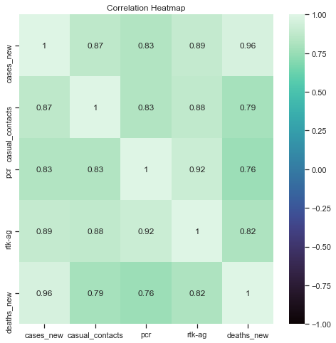
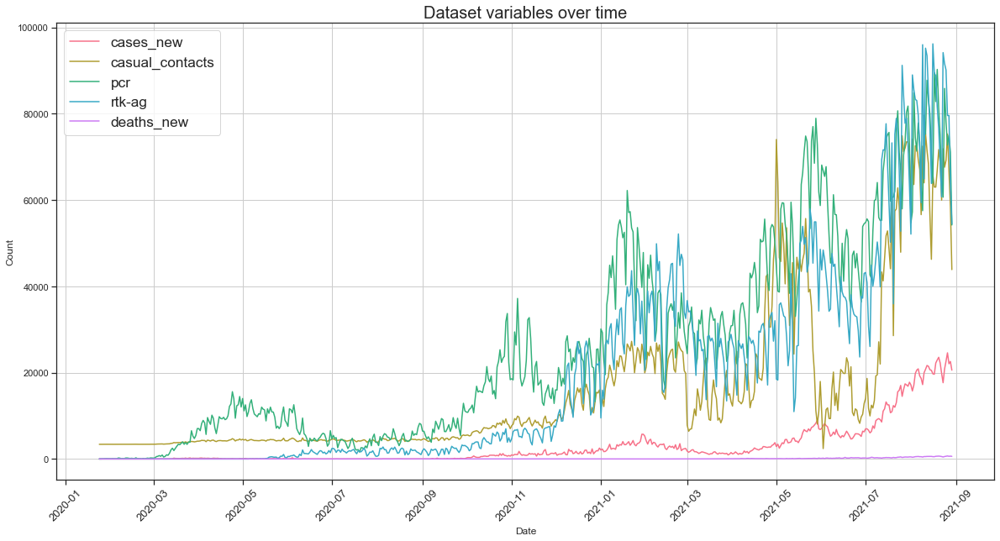
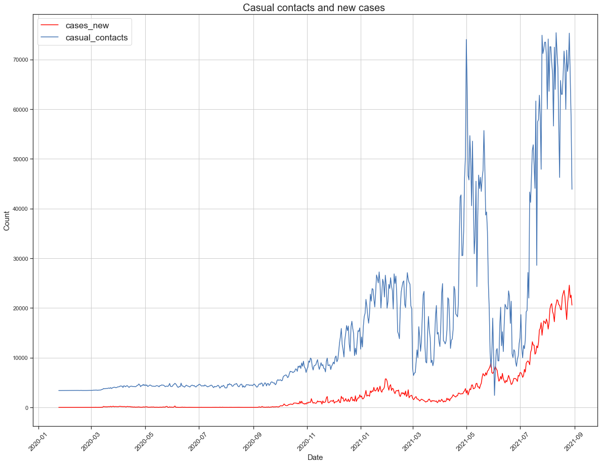
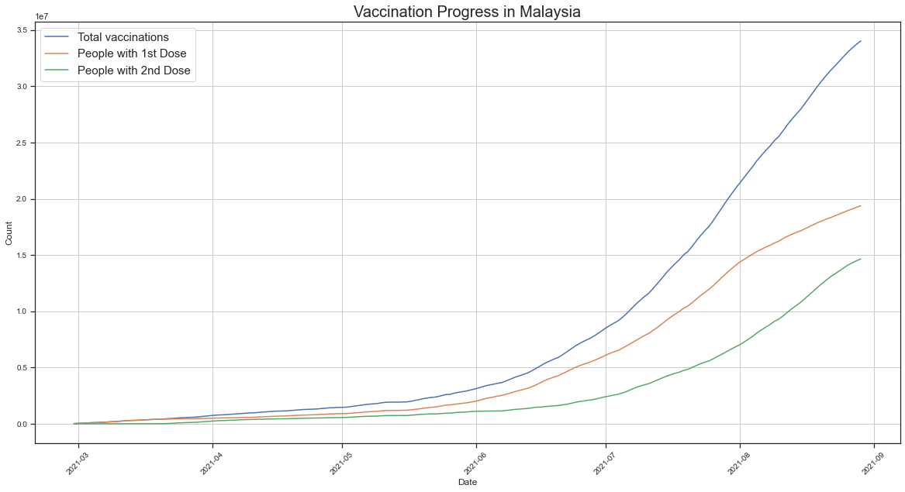
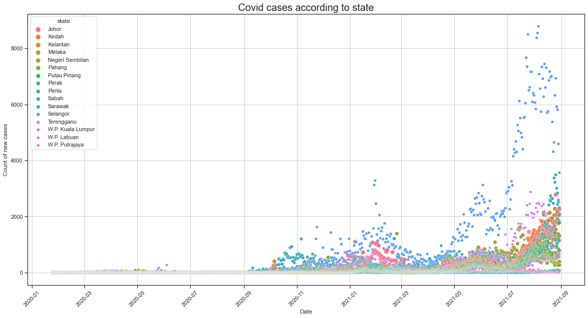
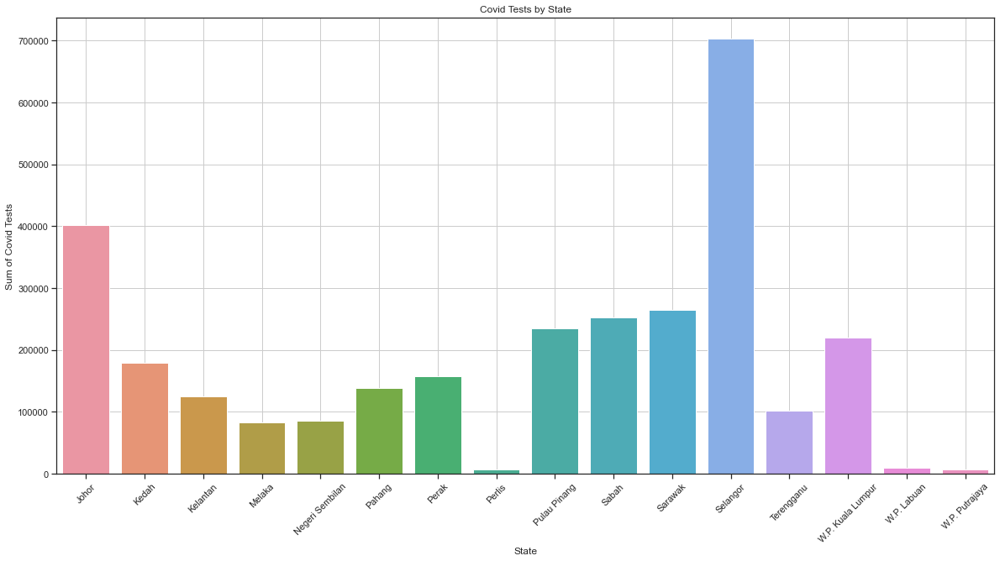
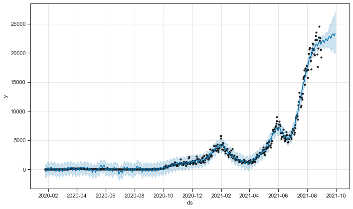
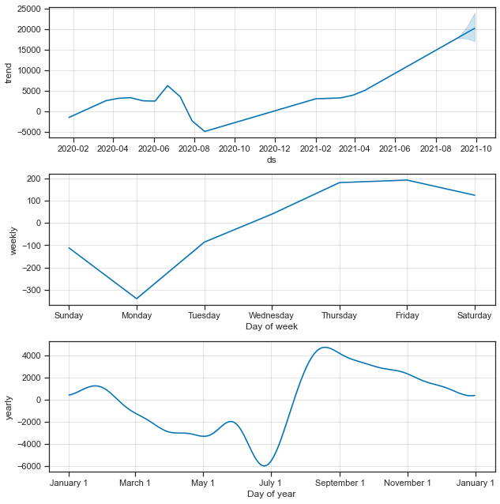

Datasets are obtained from:

https://github.com/MoH-Malaysia/covid19-public/

https://github.com/owid/covid-19-data/tree/master/public/data/vaccinations


# Importing the data
Since the data is frequently updated, we will grab the data directly from the site instead of having to download the csv files manually to perform the analysis. The other good part about this is that the analysis done in on the latest data provided. 


```python
import pandas as pd
import io
import requests
url="https://raw.githubusercontent.com/MoH-Malaysia/covid19-public/main/epidemic/tests_malaysia.csv"
s=requests.get(url).content
tests=pd.read_csv(io.StringIO(s.decode('utf-8')))
tests.to_csv('dataset/tests_malaysia.csv')
```


```python
url="https://raw.githubusercontent.com/MoH-Malaysia/covid19-public/main/epidemic/cases_malaysia.csv"
s=requests.get(url).content
cases=pd.read_csv(io.StringIO(s.decode('utf-8')))
cases.to_csv('dataset/cases_malaysia.csv')
```


```python
url="https://raw.githubusercontent.com/MoH-Malaysia/covid19-public/main/epidemic/cases_state.csv"
s=requests.get(url).content
state_cases=pd.read_csv(io.StringIO(s.decode('utf-8')))
state_cases.to_csv('dataset/cases_state.csv')
```


```python
url="https://raw.githubusercontent.com/MoH-Malaysia/covid19-public/main/mysejahtera/trace_malaysia.csv"
s=requests.get(url).content
casual_contacts=pd.read_csv(io.StringIO(s.decode('utf-8')))
casual_contacts.to_csv('dataset/trace_malaysia.csv')
```


```python
url="https://raw.githubusercontent.com/MoH-Malaysia/covid19-public/main/epidemic/deaths_malaysia.csv"
s=requests.get(url).content
deaths_public=pd.read_csv(io.StringIO(s.decode('utf-8')))
deaths_public.to_csv('dataset/deaths_malaysia.csv')
```


```python
url="https://raw.githubusercontent.com/MoH-Malaysia/covid19-public/main/epidemic/deaths_state.csv"
s=requests.get(url).content
deaths_state=pd.read_csv(io.StringIO(s.decode('utf-8')))
deaths_state.to_csv('dataset/death_state.csv')
```


```python
url="https://raw.githubusercontent.com/owid/covid-19-data/master/public/data/vaccinations/vaccinations.csv"
s=requests.get(url).content
vaccination_who=pd.read_csv(io.StringIO(s.decode('utf-8')))
vaccination_who.to_csv('dataset/vaccinations.csv')
```


```python
url="https://raw.githubusercontent.com/MoH-Malaysia/covid19-public/main/epidemic/tests_state.csv"
s=requests.get(url).content
tests_state=pd.read_csv(io.StringIO(s.decode('utf-8')))
tests_state.to_csv('dataset/tests_state.csv')
```


```python
url='https://raw.githubusercontent.com/MoH-Malaysia/covid19-public/main/static/population.csv'
s=requests.get(url).content
population=pd.read_csv(io.StringIO(s.decode('utf-8')))
population.to_csv('dataset/population.csv')
```

# EDA

## Factors that correlates to the number of new cases
In this section we will see the correlation between the variables which may be related to the rise of new cases.


```python
import numpy as np
```


```
# This is formatted as code
```

### Data Cleaning

#### Making a backup of the DataFrame


```python
df_tests=tests.copy()
df_cases=cases.copy()
df_death_public=deaths_public.copy()
df_casual_contacts=casual_contacts.copy()
```


```python
df_cases.tail()
```


<div>
<style scoped>
    .dataframe tbody tr th:only-of-type {
        vertical-align: middle;
    }

    .dataframe tbody tr th {
        vertical-align: top;
    }

    .dataframe thead th {
        text-align: right;
    }
</style>
<table border="1" class="dataframe">
  <thead>
    <tr style="text-align: right;">
      <th></th>
      <th>date</th>
      <th>cases_new</th>
      <th>cases_import</th>
      <th>cases_recovered</th>
      <th>cluster_import</th>
      <th>cluster_religious</th>
      <th>cluster_community</th>
      <th>cluster_highRisk</th>
      <th>cluster_education</th>
      <th>cluster_detentionCentre</th>
      <th>cluster_workplace</th>
    </tr>
  </thead>
  <tbody>
    <tr>
      <th>579</th>
      <td>2021-08-26</td>
      <td>24599</td>
      <td>8</td>
      <td>22655</td>
      <td>0.0</td>
      <td>24.0</td>
      <td>542.0</td>
      <td>93.0</td>
      <td>35.0</td>
      <td>73.0</td>
      <td>1944.0</td>
    </tr>
    <tr>
      <th>580</th>
      <td>2021-08-27</td>
      <td>22070</td>
      <td>15</td>
      <td>21877</td>
      <td>0.0</td>
      <td>2.0</td>
      <td>474.0</td>
      <td>17.0</td>
      <td>3.0</td>
      <td>150.0</td>
      <td>1022.0</td>
    </tr>
    <tr>
      <th>581</th>
      <td>2021-08-28</td>
      <td>22597</td>
      <td>12</td>
      <td>19492</td>
      <td>0.0</td>
      <td>6.0</td>
      <td>467.0</td>
      <td>84.0</td>
      <td>7.0</td>
      <td>92.0</td>
      <td>1505.0</td>
    </tr>
    <tr>
      <th>582</th>
      <td>2021-08-29</td>
      <td>20579</td>
      <td>7</td>
      <td>20845</td>
      <td>0.0</td>
      <td>12.0</td>
      <td>392.0</td>
      <td>16.0</td>
      <td>4.0</td>
      <td>81.0</td>
      <td>1458.0</td>
    </tr>
    <tr>
      <th>583</th>
      <td>2021-08-30</td>
      <td>19268</td>
      <td>16</td>
      <td>21257</td>
      <td>0.0</td>
      <td>4.0</td>
      <td>460.0</td>
      <td>37.0</td>
      <td>72.0</td>
      <td>89.0</td>
      <td>1034.0</td>
    </tr>
  </tbody>
</table>
</div>


#### Check for null values for all DataFrames


```python
print(df_tests.isna().sum())
print('\n')
print(df_cases.isna().sum())
print('\n')
print(df_casual_contacts.isna().sum())
print('\n')
print(df_death_public.isna().sum())
```

    date      0
    rtk-ag    0
    pcr       0
    dtype: int64
    
    
    date                         0
    cases_new                    0
    cases_import                 0
    cases_recovered              0
    cluster_import             342
    cluster_religious          342
    cluster_community          342
    cluster_highRisk           342
    cluster_education          342
    cluster_detentionCentre    342
    cluster_workplace          342
    dtype: int64
    
    
    date                0
    casual_contacts     0
    hide_large         50
    hide_small         50
    dtype: int64
    
    
    date            0
    deaths_new      0
    deaths_bid    234
    dtype: int64
    

#### Check the data types


```python
print(df_tests.dtypes)
print('\n')
print(df_cases.dtypes)
print('\n')
print(df_casual_contacts.dtypes)
print('\n')
print(df_death_public.dtypes)
```

    date      object
    rtk-ag     int64
    pcr        int64
    dtype: object
    
    
    date                        object
    cases_new                    int64
    cases_import                 int64
    cases_recovered              int64
    cluster_import             float64
    cluster_religious          float64
    cluster_community          float64
    cluster_highRisk           float64
    cluster_education          float64
    cluster_detentionCentre    float64
    cluster_workplace          float64
    dtype: object
    
    
    date                object
    casual_contacts      int64
    hide_large         float64
    hide_small         float64
    dtype: object
    
    
    date           object
    deaths_new      int64
    deaths_bid    float64
    dtype: object
    

#### Covert Date column into Datetime


```python
df_tests['date'] = pd.to_datetime(df_tests['date'])
df_cases['date'] = pd.to_datetime(df_cases['date'])
df_casual_contacts['date'] = pd.to_datetime(df_casual_contacts['date'])
df_death_public['date'] = pd.to_datetime(df_cases['date'])
```

#### Create DataFrame with selected columns


```python
df_cases_new=df_cases[['date','cases_new']]
df_casual_contacts=df_casual_contacts[['date','casual_contacts']]
df_death_total=df_death_public[['date','deaths_new']]
```


```python
new_cases_and_tests =pd.merge(df_cases_new,df_tests,on="date", how='right')
test_cases_contacts =pd.merge(new_cases_and_tests,df_casual_contacts,on="date",how='left')
df_merged =pd.merge(test_cases_contacts,df_death_total,on="date",how='left')
```


```python
df_merged.tail()
```


<div>
<style scoped>
    .dataframe tbody tr th:only-of-type {
        vertical-align: middle;
    }

    .dataframe tbody tr th {
        vertical-align: top;
    }

    .dataframe thead th {
        text-align: right;
    }
</style>
<table border="1" class="dataframe">
  <thead>
    <tr style="text-align: right;">
      <th></th>
      <th>date</th>
      <th>cases_new</th>
      <th>rtk-ag</th>
      <th>pcr</th>
      <th>casual_contacts</th>
      <th>deaths_new</th>
    </tr>
  </thead>
  <tbody>
    <tr>
      <th>579</th>
      <td>2021-08-25</td>
      <td>22642.0</td>
      <td>90167</td>
      <td>78146</td>
      <td>69220.0</td>
      <td>NaN</td>
    </tr>
    <tr>
      <th>580</th>
      <td>2021-08-26</td>
      <td>24599.0</td>
      <td>79606</td>
      <td>72735</td>
      <td>75321.0</td>
      <td>NaN</td>
    </tr>
    <tr>
      <th>581</th>
      <td>2021-08-27</td>
      <td>22070.0</td>
      <td>79606</td>
      <td>74976</td>
      <td>66642.0</td>
      <td>NaN</td>
    </tr>
    <tr>
      <th>582</th>
      <td>2021-08-28</td>
      <td>22597.0</td>
      <td>63708</td>
      <td>71096</td>
      <td>58375.0</td>
      <td>NaN</td>
    </tr>
    <tr>
      <th>583</th>
      <td>2021-08-29</td>
      <td>20579.0</td>
      <td>54462</td>
      <td>54230</td>
      <td>43888.0</td>
      <td>NaN</td>
    </tr>
  </tbody>
</table>
</div>


```python
df_merged.isna().sum()
```


    date                 0
    cases_new            1
    rtk-ag               0
    pcr                  0
    casual_contacts    402
    deaths_new          52
    dtype: int64


#### Handling null values
Since theres a substantial amount of missing values, we will use iterative imputer. It will estimate the values according to the featues.


```python
from sklearn.experimental import enable_iterative_imputer
from sklearn.impute import IterativeImputer
from sklearn.linear_model import LinearRegression
x=df_merged[['cases_new','casual_contacts','pcr','rtk-ag','deaths_new']]

it_imputer = IterativeImputer(min_value = 0)
y=it_imputer.fit_transform(x)

y = pd.DataFrame(y, columns = x.columns)
pd.DataFrame(y)

cleaned_df =pd.merge(y,df_merged['date'], left_index=True, right_index=True)

pd.DataFrame(cleaned_df)
```


<div>
<style scoped>
    .dataframe tbody tr th:only-of-type {
        vertical-align: middle;
    }

    .dataframe tbody tr th {
        vertical-align: top;
    }

    .dataframe thead th {
        text-align: right;
    }
</style>
<table border="1" class="dataframe">
  <thead>
    <tr style="text-align: right;">
      <th></th>
      <th>cases_new</th>
      <th>casual_contacts</th>
      <th>pcr</th>
      <th>rtk-ag</th>
      <th>deaths_new</th>
      <th>date</th>
    </tr>
  </thead>
  <tbody>
    <tr>
      <th>0</th>
      <td>0.0</td>
      <td>3396.759427</td>
      <td>2.0</td>
      <td>0.0</td>
      <td>1.009825</td>
      <td>2020-01-24</td>
    </tr>
    <tr>
      <th>1</th>
      <td>4.0</td>
      <td>3402.271668</td>
      <td>5.0</td>
      <td>0.0</td>
      <td>2.000000</td>
      <td>2020-01-25</td>
    </tr>
    <tr>
      <th>2</th>
      <td>0.0</td>
      <td>3397.749226</td>
      <td>14.0</td>
      <td>0.0</td>
      <td>0.000000</td>
      <td>2020-01-26</td>
    </tr>
    <tr>
      <th>3</th>
      <td>0.0</td>
      <td>3398.514204</td>
      <td>24.0</td>
      <td>0.0</td>
      <td>0.000000</td>
      <td>2020-01-27</td>
    </tr>
    <tr>
      <th>4</th>
      <td>0.0</td>
      <td>3400.661511</td>
      <td>53.0</td>
      <td>0.0</td>
      <td>1.000000</td>
      <td>2020-01-28</td>
    </tr>
    <tr>
      <th>...</th>
      <td>...</td>
      <td>...</td>
      <td>...</td>
      <td>...</td>
      <td>...</td>
      <td>...</td>
    </tr>
    <tr>
      <th>579</th>
      <td>22642.0</td>
      <td>69220.000000</td>
      <td>78146.0</td>
      <td>90167.0</td>
      <td>624.783182</td>
      <td>2021-08-25</td>
    </tr>
    <tr>
      <th>580</th>
      <td>24599.0</td>
      <td>75321.000000</td>
      <td>72735.0</td>
      <td>79606.0</td>
      <td>692.018053</td>
      <td>2021-08-26</td>
    </tr>
    <tr>
      <th>581</th>
      <td>22070.0</td>
      <td>66642.000000</td>
      <td>74976.0</td>
      <td>79606.0</td>
      <td>614.659292</td>
      <td>2021-08-27</td>
    </tr>
    <tr>
      <th>582</th>
      <td>22597.0</td>
      <td>58375.000000</td>
      <td>71096.0</td>
      <td>63708.0</td>
      <td>649.646922</td>
      <td>2021-08-28</td>
    </tr>
    <tr>
      <th>583</th>
      <td>20579.0</td>
      <td>43888.000000</td>
      <td>54230.0</td>
      <td>54462.0</td>
      <td>605.879692</td>
      <td>2021-08-29</td>
    </tr>
  </tbody>
</table>
<p>584 rows × 6 columns</p>
</div>


#### Convert numerical values to integer


```python
cleaned_df[['cases_new','casual_contacts','pcr', 'rtk-ag','deaths_new']]=cleaned_df[['cases_new','casual_contacts','pcr', 'rtk-ag','deaths_new']].astype(int)
```

#### Sort values by date


```python
cleaned_df.sort_values(by='date',ascending=True)
```


<div>
<style scoped>
    .dataframe tbody tr th:only-of-type {
        vertical-align: middle;
    }

    .dataframe tbody tr th {
        vertical-align: top;
    }

    .dataframe thead th {
        text-align: right;
    }
</style>
<table border="1" class="dataframe">
  <thead>
    <tr style="text-align: right;">
      <th></th>
      <th>cases_new</th>
      <th>casual_contacts</th>
      <th>pcr</th>
      <th>rtk-ag</th>
      <th>deaths_new</th>
      <th>date</th>
    </tr>
  </thead>
  <tbody>
    <tr>
      <th>0</th>
      <td>0</td>
      <td>3396</td>
      <td>2</td>
      <td>0</td>
      <td>1</td>
      <td>2020-01-24</td>
    </tr>
    <tr>
      <th>1</th>
      <td>4</td>
      <td>3402</td>
      <td>5</td>
      <td>0</td>
      <td>2</td>
      <td>2020-01-25</td>
    </tr>
    <tr>
      <th>2</th>
      <td>0</td>
      <td>3397</td>
      <td>14</td>
      <td>0</td>
      <td>0</td>
      <td>2020-01-26</td>
    </tr>
    <tr>
      <th>3</th>
      <td>0</td>
      <td>3398</td>
      <td>24</td>
      <td>0</td>
      <td>0</td>
      <td>2020-01-27</td>
    </tr>
    <tr>
      <th>4</th>
      <td>0</td>
      <td>3400</td>
      <td>53</td>
      <td>0</td>
      <td>1</td>
      <td>2020-01-28</td>
    </tr>
    <tr>
      <th>...</th>
      <td>...</td>
      <td>...</td>
      <td>...</td>
      <td>...</td>
      <td>...</td>
      <td>...</td>
    </tr>
    <tr>
      <th>579</th>
      <td>22642</td>
      <td>69220</td>
      <td>78146</td>
      <td>90167</td>
      <td>624</td>
      <td>2021-08-25</td>
    </tr>
    <tr>
      <th>580</th>
      <td>24599</td>
      <td>75321</td>
      <td>72735</td>
      <td>79606</td>
      <td>692</td>
      <td>2021-08-26</td>
    </tr>
    <tr>
      <th>581</th>
      <td>22070</td>
      <td>66642</td>
      <td>74976</td>
      <td>79606</td>
      <td>614</td>
      <td>2021-08-27</td>
    </tr>
    <tr>
      <th>582</th>
      <td>22597</td>
      <td>58375</td>
      <td>71096</td>
      <td>63708</td>
      <td>649</td>
      <td>2021-08-28</td>
    </tr>
    <tr>
      <th>583</th>
      <td>20579</td>
      <td>43888</td>
      <td>54230</td>
      <td>54462</td>
      <td>605</td>
      <td>2021-08-29</td>
    </tr>
  </tbody>
</table>
<p>584 rows × 6 columns</p>
</div>


### Visualization

#### Correlation matrix


```python
import seaborn as sns
import matplotlib.pyplot as plt

corr=cleaned_df.corr()
plt.figure(figsize=(8,8))

sns.heatmap(corr,annot=True,vmin=-1.0, cmap='mako')
plt.title('Correlation Heatmap')
plt.show()
```


    

    


#### Description
From the correlation matrix, we can see that there is a high positive correlation between death and new cases. This shows that as the count of new cases increase, the reported new death cases also increases. The amount of new cases is also have a high correlation with the amount of testing done. Among the two tests, rtk-ag test have a higher correlation coefficient than pcr. This may show that there are more positive cases reported by rtk-ag in comparison with pcr. Casual contacts also have a high correlation to the amount of new cases. This shows that casual contacts contributes to the amount of new covid cases.

#### Dataset variables over time


```python
import seaborn as sns
import matplotlib.pyplot as plt

fig=plt.figure(figsize=(20,10))
plt.title('Dataset variables over time',fontsize=20)
plt.xticks(rotation=45,fontsize=13)
#sns.scatterplot(data=pd.melt(new_cases_and_tests, 'date'), x="date", y='value',hue='variable')
sns.lineplot(data=pd.melt(cleaned_df, 'date'), x="date", y='value',hue='variable',palette='husl')
plt.legend(fontsize='x-large', title_fontsize=20)

plt.xlabel('Date')
plt.ylabel('Count')

plt.grid()
plt.show()
```


    

    


##### Description
From the plot, we can see that the variables are having an upward trend as time progress. Notice the presence some occasional dips in the number of casual contacts everytime cases hits an all new time high which possibly due to the implementation of stricter Movement Control Order where people are refrained from travelling and even going out. This can be further seen on the filtered linegraph below.


```python
import seaborn as sns
import matplotlib.pyplot as plt

fig=plt.figure(figsize=(20,15))
plt.title('Casual contacts and new cases ',fontsize=20)
plt.xticks(rotation=45,fontsize=13)

colors = ["#FF0B04", "#4374B3"]


sns.lineplot(data=pd.melt(cleaned_df[['cases_new','casual_contacts','date']], 'date'),
             x="date",
             y='value',
             hue='variable',
             palette=colors
            )

plt.legend(fontsize='x-large', title_fontsize=10)

plt.xlabel('Date',fontsize=15)
plt.ylabel('Count',fontsize=15)

plt.grid()
plt.show()
```


    

    


## Herd immunity
The first part that we want to analyze is the herd immunity achieved in Malaysia. Based on the government's target, we need to have 80% of the population fully vaccinated against Covid-19 in order to achieve herd immunity.

### Data Cleaning

#### Making a backup of the DataFrame

Just in case something happen, we can revert to its original values without updating from the dataset link.


```python
df_vaccination = vaccination_who.copy()
df_population = population.copy()
```


```python
df_vaccination.head()
```


<div>
<style scoped>
    .dataframe tbody tr th:only-of-type {
        vertical-align: middle;
    }

    .dataframe tbody tr th {
        vertical-align: top;
    }

    .dataframe thead th {
        text-align: right;
    }
</style>
<table border="1" class="dataframe">
  <thead>
    <tr style="text-align: right;">
      <th></th>
      <th>location</th>
      <th>iso_code</th>
      <th>date</th>
      <th>total_vaccinations</th>
      <th>people_vaccinated</th>
      <th>people_fully_vaccinated</th>
      <th>total_boosters</th>
      <th>daily_vaccinations_raw</th>
      <th>daily_vaccinations</th>
      <th>total_vaccinations_per_hundred</th>
      <th>people_vaccinated_per_hundred</th>
      <th>people_fully_vaccinated_per_hundred</th>
      <th>total_boosters_per_hundred</th>
      <th>daily_vaccinations_per_million</th>
    </tr>
  </thead>
  <tbody>
    <tr>
      <th>0</th>
      <td>Afghanistan</td>
      <td>AFG</td>
      <td>2021-02-22</td>
      <td>0.0</td>
      <td>0.0</td>
      <td>NaN</td>
      <td>NaN</td>
      <td>NaN</td>
      <td>NaN</td>
      <td>0.0</td>
      <td>0.0</td>
      <td>NaN</td>
      <td>NaN</td>
      <td>NaN</td>
    </tr>
    <tr>
      <th>1</th>
      <td>Afghanistan</td>
      <td>AFG</td>
      <td>2021-02-23</td>
      <td>NaN</td>
      <td>NaN</td>
      <td>NaN</td>
      <td>NaN</td>
      <td>NaN</td>
      <td>1367.0</td>
      <td>NaN</td>
      <td>NaN</td>
      <td>NaN</td>
      <td>NaN</td>
      <td>34.0</td>
    </tr>
    <tr>
      <th>2</th>
      <td>Afghanistan</td>
      <td>AFG</td>
      <td>2021-02-24</td>
      <td>NaN</td>
      <td>NaN</td>
      <td>NaN</td>
      <td>NaN</td>
      <td>NaN</td>
      <td>1367.0</td>
      <td>NaN</td>
      <td>NaN</td>
      <td>NaN</td>
      <td>NaN</td>
      <td>34.0</td>
    </tr>
    <tr>
      <th>3</th>
      <td>Afghanistan</td>
      <td>AFG</td>
      <td>2021-02-25</td>
      <td>NaN</td>
      <td>NaN</td>
      <td>NaN</td>
      <td>NaN</td>
      <td>NaN</td>
      <td>1367.0</td>
      <td>NaN</td>
      <td>NaN</td>
      <td>NaN</td>
      <td>NaN</td>
      <td>34.0</td>
    </tr>
    <tr>
      <th>4</th>
      <td>Afghanistan</td>
      <td>AFG</td>
      <td>2021-02-26</td>
      <td>NaN</td>
      <td>NaN</td>
      <td>NaN</td>
      <td>NaN</td>
      <td>NaN</td>
      <td>1367.0</td>
      <td>NaN</td>
      <td>NaN</td>
      <td>NaN</td>
      <td>NaN</td>
      <td>34.0</td>
    </tr>
  </tbody>
</table>
</div>


```python
df_population.head()
```


<div>
<style scoped>
    .dataframe tbody tr th:only-of-type {
        vertical-align: middle;
    }

    .dataframe tbody tr th {
        vertical-align: top;
    }

    .dataframe thead th {
        text-align: right;
    }
</style>
<table border="1" class="dataframe">
  <thead>
    <tr style="text-align: right;">
      <th></th>
      <th>state</th>
      <th>idxs</th>
      <th>pop</th>
      <th>pop_18</th>
      <th>pop_60</th>
    </tr>
  </thead>
  <tbody>
    <tr>
      <th>0</th>
      <td>Malaysia</td>
      <td>0</td>
      <td>32657400</td>
      <td>23409600</td>
      <td>3502000</td>
    </tr>
    <tr>
      <th>1</th>
      <td>Johor</td>
      <td>1</td>
      <td>3781000</td>
      <td>2711900</td>
      <td>428700</td>
    </tr>
    <tr>
      <th>2</th>
      <td>Kedah</td>
      <td>2</td>
      <td>2185100</td>
      <td>1540600</td>
      <td>272500</td>
    </tr>
    <tr>
      <th>3</th>
      <td>Kelantan</td>
      <td>3</td>
      <td>1906700</td>
      <td>1236200</td>
      <td>194100</td>
    </tr>
    <tr>
      <th>4</th>
      <td>Melaka</td>
      <td>4</td>
      <td>932700</td>
      <td>677400</td>
      <td>118500</td>
    </tr>
  </tbody>
</table>
</div>


#### Filter columns and rows


```python
df_population = df_population[df_population['state']=='Malaysia']
df_vaccination = df_vaccination[df_vaccination['iso_code'] =='MYS']
```


```python
df_vax_col = df_vaccination[['date', 'total_vaccinations', 'people_vaccinated' , 'people_fully_vaccinated','daily_vaccinations']]
```

#### Covert Date column into Datetime


```python
df_vax_col['date'] = pd.to_datetime(df_vax_col['date'])
```

    <ipython-input-162-eef09d30cdd7>:1: SettingWithCopyWarning: 
    A value is trying to be set on a copy of a slice from a DataFrame.
    Try using .loc[row_indexer,col_indexer] = value instead
    
    See the caveats in the documentation: https://pandas.pydata.org/pandas-docs/stable/user_guide/indexing.html#returning-a-view-versus-a-copy
      df_vax_col['date'] = pd.to_datetime(df_vax_col['date'])
    

#### Check for null values
If the rows with null values isn't that abundant, we can drop these rows


```python
print(df_vax_col.isna().sum())
```

    date                       0
    total_vaccinations         0
    people_vaccinated          0
    people_fully_vaccinated    4
    daily_vaccinations         1
    dtype: int64
    


```python
df_vax_col.dropna(inplace=True)
```

    <ipython-input-164-c9825b337e79>:1: SettingWithCopyWarning: 
    A value is trying to be set on a copy of a slice from a DataFrame
    
    See the caveats in the documentation: https://pandas.pydata.org/pandas-docs/stable/user_guide/indexing.html#returning-a-view-versus-a-copy
      df_vax_col.dropna(inplace=True)
    


```python
df_vax_col
```


<div>
<style scoped>
    .dataframe tbody tr th:only-of-type {
        vertical-align: middle;
    }

    .dataframe tbody tr th {
        vertical-align: top;
    }

    .dataframe thead th {
        text-align: right;
    }
</style>
<table border="1" class="dataframe">
  <thead>
    <tr style="text-align: right;">
      <th></th>
      <th>date</th>
      <th>total_vaccinations</th>
      <th>people_vaccinated</th>
      <th>people_fully_vaccinated</th>
      <th>daily_vaccinations</th>
    </tr>
  </thead>
  <tbody>
    <tr>
      <th>24008</th>
      <td>2021-02-28</td>
      <td>18721.0</td>
      <td>18718.0</td>
      <td>3.0</td>
      <td>4665.0</td>
    </tr>
    <tr>
      <th>24009</th>
      <td>2021-03-01</td>
      <td>34093.0</td>
      <td>34086.0</td>
      <td>7.0</td>
      <td>6807.0</td>
    </tr>
    <tr>
      <th>24010</th>
      <td>2021-03-02</td>
      <td>55749.0</td>
      <td>55739.0</td>
      <td>10.0</td>
      <td>9282.0</td>
    </tr>
    <tr>
      <th>24011</th>
      <td>2021-03-03</td>
      <td>78413.0</td>
      <td>78398.0</td>
      <td>15.0</td>
      <td>11193.0</td>
    </tr>
    <tr>
      <th>24012</th>
      <td>2021-03-04</td>
      <td>97954.0</td>
      <td>97925.0</td>
      <td>29.0</td>
      <td>13821.0</td>
    </tr>
    <tr>
      <th>...</th>
      <td>...</td>
      <td>...</td>
      <td>...</td>
      <td>...</td>
      <td>...</td>
    </tr>
    <tr>
      <th>24186</th>
      <td>2021-08-25</td>
      <td>32635907.0</td>
      <td>18792979.0</td>
      <td>13842928.0</td>
      <td>450794.0</td>
    </tr>
    <tr>
      <th>24187</th>
      <td>2021-08-26</td>
      <td>33044202.0</td>
      <td>18948648.0</td>
      <td>14095554.0</td>
      <td>434903.0</td>
    </tr>
    <tr>
      <th>24188</th>
      <td>2021-08-27</td>
      <td>33388102.0</td>
      <td>19090519.0</td>
      <td>14297962.0</td>
      <td>414730.0</td>
    </tr>
    <tr>
      <th>24189</th>
      <td>2021-08-28</td>
      <td>33724744.0</td>
      <td>19241567.0</td>
      <td>14487972.0</td>
      <td>395723.0</td>
    </tr>
    <tr>
      <th>24190</th>
      <td>2021-08-29</td>
      <td>34027548.0</td>
      <td>19384218.0</td>
      <td>14648590.0</td>
      <td>375966.0</td>
    </tr>
  </tbody>
</table>
<p>183 rows × 5 columns</p>
</div>


### Visualization

#### Merging datasets


```python
df_pop = df_population['pop']
```


```python
df_vax_herd = df_vax_col.merge(df_pop, how='cross')
```


```python
df_vax_col
```


<div>
<style scoped>
    .dataframe tbody tr th:only-of-type {
        vertical-align: middle;
    }

    .dataframe tbody tr th {
        vertical-align: top;
    }

    .dataframe thead th {
        text-align: right;
    }
</style>
<table border="1" class="dataframe">
  <thead>
    <tr style="text-align: right;">
      <th></th>
      <th>date</th>
      <th>total_vaccinations</th>
      <th>people_vaccinated</th>
      <th>people_fully_vaccinated</th>
      <th>daily_vaccinations</th>
    </tr>
  </thead>
  <tbody>
    <tr>
      <th>24008</th>
      <td>2021-02-28</td>
      <td>18721.0</td>
      <td>18718.0</td>
      <td>3.0</td>
      <td>4665.0</td>
    </tr>
    <tr>
      <th>24009</th>
      <td>2021-03-01</td>
      <td>34093.0</td>
      <td>34086.0</td>
      <td>7.0</td>
      <td>6807.0</td>
    </tr>
    <tr>
      <th>24010</th>
      <td>2021-03-02</td>
      <td>55749.0</td>
      <td>55739.0</td>
      <td>10.0</td>
      <td>9282.0</td>
    </tr>
    <tr>
      <th>24011</th>
      <td>2021-03-03</td>
      <td>78413.0</td>
      <td>78398.0</td>
      <td>15.0</td>
      <td>11193.0</td>
    </tr>
    <tr>
      <th>24012</th>
      <td>2021-03-04</td>
      <td>97954.0</td>
      <td>97925.0</td>
      <td>29.0</td>
      <td>13821.0</td>
    </tr>
    <tr>
      <th>...</th>
      <td>...</td>
      <td>...</td>
      <td>...</td>
      <td>...</td>
      <td>...</td>
    </tr>
    <tr>
      <th>24186</th>
      <td>2021-08-25</td>
      <td>32635907.0</td>
      <td>18792979.0</td>
      <td>13842928.0</td>
      <td>450794.0</td>
    </tr>
    <tr>
      <th>24187</th>
      <td>2021-08-26</td>
      <td>33044202.0</td>
      <td>18948648.0</td>
      <td>14095554.0</td>
      <td>434903.0</td>
    </tr>
    <tr>
      <th>24188</th>
      <td>2021-08-27</td>
      <td>33388102.0</td>
      <td>19090519.0</td>
      <td>14297962.0</td>
      <td>414730.0</td>
    </tr>
    <tr>
      <th>24189</th>
      <td>2021-08-28</td>
      <td>33724744.0</td>
      <td>19241567.0</td>
      <td>14487972.0</td>
      <td>395723.0</td>
    </tr>
    <tr>
      <th>24190</th>
      <td>2021-08-29</td>
      <td>34027548.0</td>
      <td>19384218.0</td>
      <td>14648590.0</td>
      <td>375966.0</td>
    </tr>
  </tbody>
</table>
<p>183 rows × 5 columns</p>
</div>


#### Plot of Vaccination Progress in Malaysia


```python
import seaborn as sns
import matplotlib.pyplot as plt

fig=plt.figure(figsize=(20,10))

date = df_vax_herd['date']
sns.lineplot(x=date, y=df_vax_herd['total_vaccinations'], label = "Total vaccinations")
sns.lineplot(x=date, y=df_vax_herd['people_vaccinated'], label = "People with 1st Dose")
sns.lineplot(x=date, y=df_vax_herd['people_fully_vaccinated'], label = "People with 2nd Dose")
#sns.lineplot(x=date, y=df_vax_herd['daily_vaccinations'], label = "Daily Vaccinations rate")

plt.title('Vaccination Progress in Malaysia', fontsize = 20)

plt.grid()
plt.xticks(rotation=45, fontsize = 10)
plt.xlabel('Date')

plt.yticks(fontsize = 10)
plt.ylabel('Count')

plt.legend(fontsize = 15)
plt.show()
```


    

    


#### Plot of Malaysia's Herd Immunity percentage
Equation Herd Immunity is as follows:

    Herd% = (Sum of Fully Vaccinated/Total Popuation) * 100


```python
df_vax_herd['herd_immunity'] = (df_vax_herd['people_fully_vaccinated'] / df_vax_herd['pop']) * 100
```


```python
import seaborn as sns
import matplotlib.pyplot as plt

fig=plt.figure(figsize=(20,10))

sns.lineplot(data=df_vax_herd,x=df_vax_herd['date'],y=df_vax_herd['herd_immunity'],linewidth = 2.5,color='red')
plt.title("Covid-19 Herd Immunity Progress in Malaysia", fontsize=20)
plt.xlabel("Date")
plt.ylabel("Percentage")
plt.grid()
plt.show()
```


    

    


##### Description:
The vaccine admnistration had exponentially increased with a slight decreased rate aproaching September 2021.


```python
herd_immunity = (df_vax_herd['people_fully_vaccinated'].iloc[-1:,] / df_vax_herd['pop'].iloc[-1:,]) * 100
```


```python
print("Malaysia's Herd Immunity Percentage: " + (herd_immunity.round(2).astype(str) + " %"))
```

    182    Malaysia's Herd Immunity Percentage: 44.86 %
    dtype: object
    

## Covid-19 cases by state
This section will narrow down the analysis into each state. 

### Count of new cases by state

#### Data Cleaning


```python
df_state_cases=state_cases.copy()
df_death_public=deaths_public.copy()
df_death_state=deaths_state.copy()
```


```python
df_state_cases.head()
#df_death_public.head()
#df_death_state.head()
```


<div>
<style scoped>
    .dataframe tbody tr th:only-of-type {
        vertical-align: middle;
    }

    .dataframe tbody tr th {
        vertical-align: top;
    }

    .dataframe thead th {
        text-align: right;
    }
</style>
<table border="1" class="dataframe">
  <thead>
    <tr style="text-align: right;">
      <th></th>
      <th>date</th>
      <th>state</th>
      <th>cases_new</th>
      <th>cases_import</th>
      <th>cases_recovered</th>
    </tr>
  </thead>
  <tbody>
    <tr>
      <th>0</th>
      <td>2020-01-25</td>
      <td>Johor</td>
      <td>4</td>
      <td>4</td>
      <td>0.0</td>
    </tr>
    <tr>
      <th>1</th>
      <td>2020-01-25</td>
      <td>Kedah</td>
      <td>0</td>
      <td>0</td>
      <td>0.0</td>
    </tr>
    <tr>
      <th>2</th>
      <td>2020-01-25</td>
      <td>Kelantan</td>
      <td>0</td>
      <td>0</td>
      <td>0.0</td>
    </tr>
    <tr>
      <th>3</th>
      <td>2020-01-25</td>
      <td>Melaka</td>
      <td>0</td>
      <td>0</td>
      <td>0.0</td>
    </tr>
    <tr>
      <th>4</th>
      <td>2020-01-25</td>
      <td>Negeri Sembilan</td>
      <td>0</td>
      <td>0</td>
      <td>0.0</td>
    </tr>
  </tbody>
</table>
</div>


```python
df_state_cases['date'] = pd.to_datetime(df_state_cases['date'])
df_death_public['date'] = pd.to_datetime(df_death_public['date'])
df_death_state['date'] = pd.to_datetime(df_death_state['date'])
```


```python
df_state_cases.isna().sum()
```


    date                0
    state               0
    cases_new           0
    cases_import        0
    cases_recovered    48
    dtype: int64


#### Visualization

##### Plot of New Cases from each State 


```python
import seaborn as sns
import matplotlib.pyplot as plt

fig=plt.figure(figsize=(20,10))
plt.title("Covid cases according to state", fontsize=20)

sns.set_theme(style="ticks")
sns.scatterplot(y='cases_new', x='date',hue='state',size="state",data=df_state_cases)

plt.xlabel('Date')
plt.ylabel('Count of new cases')

plt.grid()
plt.xticks(rotation=45)
plt.show()
```


    

    


###### Description: 
The plot shows that Selangor had significatly more cases throughout the time.Around April 2021, there is a low dip after the second ATH that occured around February 2021, and continued to increase exponantially going forward.

### Tests by state

#### Preparing Data


```python
df_tests_state = tests_state.copy()
```

##### Sum of tests by state


```python
df_ts = df_tests_state.groupby(['state']).sum()
```


```python
df_ts.reset_index(inplace=True)
```

##### Sum values both testing types


```python
df_ts['total_test'] = (df_ts['rtk-ag'] + df_ts['pcr'])
```

#### Visualization

##### Plot of Total Covid Tests By State


```python
import seaborn as sns
import matplotlib.pyplot as plt
fig=plt.figure(figsize=(20,10))
plt.title("Covid Tests by State")
sns.barplot(x="state", y="total_test", data=df_ts)
plt.grid()
plt.xlabel('State')
plt.ylabel('Sum of Covid Tests')
plt.xticks(rotation=45)
plt.show()
```


    

    


###### Description:
From the Covid Tests by State plot, we can see the top 3 states that have run the most test are Selangor, Johor, and, Sarawak. Despite being near to the Selangor state, W.P Putrajaya had significatly fewer tests done in the area.

# Covid-19 cases forecast
For the forecast, we wil make use of two procedures of forecasting which is first by using Prophet and then by using NeuralProphet. 

## Forecasting with Prophet

### Install dependecies


```python
#Prophet Dependencies
#!pip install pystan==2.19.1.1
#!pip install prophet
```


```python
#if unable to install
#conda install --override-channels -c main -c conda-forge boost
```

### Import Prophet


```python
from prophet import Prophet
```

### Create y and ds DataFrame


```python
#pdf=cleaned_df.copy()
pdf = df_cases.copy()
pdf.tail()
```


<div>
<style scoped>
    .dataframe tbody tr th:only-of-type {
        vertical-align: middle;
    }

    .dataframe tbody tr th {
        vertical-align: top;
    }

    .dataframe thead th {
        text-align: right;
    }
</style>
<table border="1" class="dataframe">
  <thead>
    <tr style="text-align: right;">
      <th></th>
      <th>date</th>
      <th>cases_new</th>
      <th>cases_import</th>
      <th>cases_recovered</th>
      <th>cluster_import</th>
      <th>cluster_religious</th>
      <th>cluster_community</th>
      <th>cluster_highRisk</th>
      <th>cluster_education</th>
      <th>cluster_detentionCentre</th>
      <th>cluster_workplace</th>
    </tr>
  </thead>
  <tbody>
    <tr>
      <th>579</th>
      <td>2021-08-26</td>
      <td>24599</td>
      <td>8</td>
      <td>22655</td>
      <td>0.0</td>
      <td>24.0</td>
      <td>542.0</td>
      <td>93.0</td>
      <td>35.0</td>
      <td>73.0</td>
      <td>1944.0</td>
    </tr>
    <tr>
      <th>580</th>
      <td>2021-08-27</td>
      <td>22070</td>
      <td>15</td>
      <td>21877</td>
      <td>0.0</td>
      <td>2.0</td>
      <td>474.0</td>
      <td>17.0</td>
      <td>3.0</td>
      <td>150.0</td>
      <td>1022.0</td>
    </tr>
    <tr>
      <th>581</th>
      <td>2021-08-28</td>
      <td>22597</td>
      <td>12</td>
      <td>19492</td>
      <td>0.0</td>
      <td>6.0</td>
      <td>467.0</td>
      <td>84.0</td>
      <td>7.0</td>
      <td>92.0</td>
      <td>1505.0</td>
    </tr>
    <tr>
      <th>582</th>
      <td>2021-08-29</td>
      <td>20579</td>
      <td>7</td>
      <td>20845</td>
      <td>0.0</td>
      <td>12.0</td>
      <td>392.0</td>
      <td>16.0</td>
      <td>4.0</td>
      <td>81.0</td>
      <td>1458.0</td>
    </tr>
    <tr>
      <th>583</th>
      <td>2021-08-30</td>
      <td>19268</td>
      <td>16</td>
      <td>21257</td>
      <td>0.0</td>
      <td>4.0</td>
      <td>460.0</td>
      <td>37.0</td>
      <td>72.0</td>
      <td>89.0</td>
      <td>1034.0</td>
    </tr>
  </tbody>
</table>
</div>


```python
pdf.dtypes
```


    date                       datetime64[ns]
    cases_new                           int64
    cases_import                        int64
    cases_recovered                     int64
    cluster_import                    float64
    cluster_religious                 float64
    cluster_community                 float64
    cluster_highRisk                  float64
    cluster_education                 float64
    cluster_detentionCentre           float64
    cluster_workplace                 float64
    dtype: object


```python
pdf=pdf[['cases_new','date']]
pdf.columns = ['y', 'ds']
```


```python
pdf.tail()
```


<div>
<style scoped>
    .dataframe tbody tr th:only-of-type {
        vertical-align: middle;
    }

    .dataframe tbody tr th {
        vertical-align: top;
    }

    .dataframe thead th {
        text-align: right;
    }
</style>
<table border="1" class="dataframe">
  <thead>
    <tr style="text-align: right;">
      <th></th>
      <th>y</th>
      <th>ds</th>
    </tr>
  </thead>
  <tbody>
    <tr>
      <th>579</th>
      <td>24599</td>
      <td>2021-08-26</td>
    </tr>
    <tr>
      <th>580</th>
      <td>22070</td>
      <td>2021-08-27</td>
    </tr>
    <tr>
      <th>581</th>
      <td>22597</td>
      <td>2021-08-28</td>
    </tr>
    <tr>
      <th>582</th>
      <td>20579</td>
      <td>2021-08-29</td>
    </tr>
    <tr>
      <th>583</th>
      <td>19268</td>
      <td>2021-08-30</td>
    </tr>
  </tbody>
</table>
</div>


### Hyperparameter tuning


```python
import itertools    
from prophet.diagnostics import cross_validation
from prophet.diagnostics import performance_metrics


#cutoffs = pd.to_datetime(['2013-02-15', '2013-08-15', '2014-02-15'])

param_grid = {  
    'changepoint_prior_scale': [0.001, 0.01, 0.1, 0.5],
    'seasonality_prior_scale': [0.01, 0.1, 1.0, 10.0],
}

# Generate all combinations of parameters
all_params = [dict(zip(param_grid.keys(), v)) for v in itertools.product(*param_grid.values())]
rmses = []  # Store the RMSEs for each params here

# Use cross validation to evaluate all parameters
for params in all_params:
    m = Prophet(**params).fit(pdf)  # Fit model with given params
    df_cv = cross_validation(m, initial='467 days', horizon='90 days', parallel="processes")
    df_p = performance_metrics(df_cv, rolling_window=1)
    rmses.append(df_p['rmse'].values[0])

# Find the best parameters
tuning_results = pd.DataFrame(all_params)
tuning_results['rmse'] = rmses
print(tuning_results)
```

    INFO:prophet:Disabling yearly seasonality. Run prophet with yearly_seasonality=True to override this.
    INFO:prophet:Disabling daily seasonality. Run prophet with daily_seasonality=True to override this.
    WARNING:prophet.models:Optimization terminated abnormally. Falling back to Newton.
    INFO:prophet:Making 1 forecasts with cutoffs between 2021-06-01 00:00:00 and 2021-06-01 00:00:00
    INFO:prophet:Applying in parallel with <concurrent.futures.process.ProcessPoolExecutor object at 0x00000206310261C0>
    INFO:prophet:Disabling yearly seasonality. Run prophet with yearly_seasonality=True to override this.
    INFO:prophet:Disabling daily seasonality. Run prophet with daily_seasonality=True to override this.
    WARNING:prophet.models:Optimization terminated abnormally. Falling back to Newton.
    INFO:prophet:Making 1 forecasts with cutoffs between 2021-06-01 00:00:00 and 2021-06-01 00:00:00
    INFO:prophet:Applying in parallel with <concurrent.futures.process.ProcessPoolExecutor object at 0x0000020630F727F0>
    INFO:prophet:Disabling yearly seasonality. Run prophet with yearly_seasonality=True to override this.
    INFO:prophet:Disabling daily seasonality. Run prophet with daily_seasonality=True to override this.
    WARNING:prophet.models:Optimization terminated abnormally. Falling back to Newton.
    INFO:prophet:Making 1 forecasts with cutoffs between 2021-06-01 00:00:00 and 2021-06-01 00:00:00
    INFO:prophet:Applying in parallel with <concurrent.futures.process.ProcessPoolExecutor object at 0x000002062CF19FD0>
    INFO:prophet:Disabling yearly seasonality. Run prophet with yearly_seasonality=True to override this.
    INFO:prophet:Disabling daily seasonality. Run prophet with daily_seasonality=True to override this.
    WARNING:prophet.models:Optimization terminated abnormally. Falling back to Newton.
    INFO:prophet:Making 1 forecasts with cutoffs between 2021-06-01 00:00:00 and 2021-06-01 00:00:00
    INFO:prophet:Applying in parallel with <concurrent.futures.process.ProcessPoolExecutor object at 0x0000020630F72820>
    INFO:prophet:Disabling yearly seasonality. Run prophet with yearly_seasonality=True to override this.
    INFO:prophet:Disabling daily seasonality. Run prophet with daily_seasonality=True to override this.
    INFO:prophet:Making 1 forecasts with cutoffs between 2021-06-01 00:00:00 and 2021-06-01 00:00:00
    INFO:prophet:Applying in parallel with <concurrent.futures.process.ProcessPoolExecutor object at 0x0000020630F287F0>
    INFO:prophet:Disabling yearly seasonality. Run prophet with yearly_seasonality=True to override this.
    INFO:prophet:Disabling daily seasonality. Run prophet with daily_seasonality=True to override this.
    INFO:prophet:Making 1 forecasts with cutoffs between 2021-06-01 00:00:00 and 2021-06-01 00:00:00
    INFO:prophet:Applying in parallel with <concurrent.futures.process.ProcessPoolExecutor object at 0x000002063161ED00>
    INFO:prophet:Disabling yearly seasonality. Run prophet with yearly_seasonality=True to override this.
    INFO:prophet:Disabling daily seasonality. Run prophet with daily_seasonality=True to override this.
    INFO:prophet:Making 1 forecasts with cutoffs between 2021-06-01 00:00:00 and 2021-06-01 00:00:00
    INFO:prophet:Applying in parallel with <concurrent.futures.process.ProcessPoolExecutor object at 0x000002063162A880>
    INFO:prophet:Disabling yearly seasonality. Run prophet with yearly_seasonality=True to override this.
    INFO:prophet:Disabling daily seasonality. Run prophet with daily_seasonality=True to override this.
    INFO:prophet:Making 1 forecasts with cutoffs between 2021-06-01 00:00:00 and 2021-06-01 00:00:00
    INFO:prophet:Applying in parallel with <concurrent.futures.process.ProcessPoolExecutor object at 0x00000206310267C0>
    INFO:prophet:Disabling yearly seasonality. Run prophet with yearly_seasonality=True to override this.
    INFO:prophet:Disabling daily seasonality. Run prophet with daily_seasonality=True to override this.
    INFO:prophet:Making 1 forecasts with cutoffs between 2021-06-01 00:00:00 and 2021-06-01 00:00:00
    INFO:prophet:Applying in parallel with <concurrent.futures.process.ProcessPoolExecutor object at 0x00000206311BA7C0>
    INFO:prophet:Disabling yearly seasonality. Run prophet with yearly_seasonality=True to override this.
    INFO:prophet:Disabling daily seasonality. Run prophet with daily_seasonality=True to override this.
    INFO:prophet:Making 1 forecasts with cutoffs between 2021-06-01 00:00:00 and 2021-06-01 00:00:00
    INFO:prophet:Applying in parallel with <concurrent.futures.process.ProcessPoolExecutor object at 0x0000020630FA0520>
    INFO:prophet:Disabling yearly seasonality. Run prophet with yearly_seasonality=True to override this.
    INFO:prophet:Disabling daily seasonality. Run prophet with daily_seasonality=True to override this.
    INFO:prophet:Making 1 forecasts with cutoffs between 2021-06-01 00:00:00 and 2021-06-01 00:00:00
    INFO:prophet:Applying in parallel with <concurrent.futures.process.ProcessPoolExecutor object at 0x0000020631183430>
    INFO:prophet:Disabling yearly seasonality. Run prophet with yearly_seasonality=True to override this.
    INFO:prophet:Disabling daily seasonality. Run prophet with daily_seasonality=True to override this.
    INFO:prophet:Making 1 forecasts with cutoffs between 2021-06-01 00:00:00 and 2021-06-01 00:00:00
    INFO:prophet:Applying in parallel with <concurrent.futures.process.ProcessPoolExecutor object at 0x00000206310261C0>
    INFO:prophet:Disabling yearly seasonality. Run prophet with yearly_seasonality=True to override this.
    INFO:prophet:Disabling daily seasonality. Run prophet with daily_seasonality=True to override this.
    INFO:prophet:Making 1 forecasts with cutoffs between 2021-06-01 00:00:00 and 2021-06-01 00:00:00
    INFO:prophet:Applying in parallel with <concurrent.futures.process.ProcessPoolExecutor object at 0x00000206310261C0>
    INFO:prophet:Disabling yearly seasonality. Run prophet with yearly_seasonality=True to override this.
    INFO:prophet:Disabling daily seasonality. Run prophet with daily_seasonality=True to override this.
    INFO:prophet:Making 1 forecasts with cutoffs between 2021-06-01 00:00:00 and 2021-06-01 00:00:00
    INFO:prophet:Applying in parallel with <concurrent.futures.process.ProcessPoolExecutor object at 0x00000206311BA220>
    INFO:prophet:Disabling yearly seasonality. Run prophet with yearly_seasonality=True to override this.
    INFO:prophet:Disabling daily seasonality. Run prophet with daily_seasonality=True to override this.
    INFO:prophet:Making 1 forecasts with cutoffs between 2021-06-01 00:00:00 and 2021-06-01 00:00:00
    INFO:prophet:Applying in parallel with <concurrent.futures.process.ProcessPoolExecutor object at 0x0000020630F8A3D0>
    INFO:prophet:Disabling yearly seasonality. Run prophet with yearly_seasonality=True to override this.
    INFO:prophet:Disabling daily seasonality. Run prophet with daily_seasonality=True to override this.
    INFO:prophet:Making 1 forecasts with cutoffs between 2021-06-01 00:00:00 and 2021-06-01 00:00:00
    INFO:prophet:Applying in parallel with <concurrent.futures.process.ProcessPoolExecutor object at 0x00000206316853D0>
    

        changepoint_prior_scale  seasonality_prior_scale          rmse
    0                     0.001                     0.01  10921.661903
    1                     0.001                     0.10  10919.509611
    2                     0.001                     1.00  10922.932525
    3                     0.001                    10.00  10922.933597
    4                     0.010                     0.01  10436.432092
    5                     0.010                     0.10  10454.540248
    6                     0.010                     1.00  10416.027803
    7                     0.010                    10.00  10388.626258
    8                     0.100                     0.01   9407.677955
    9                     0.100                     0.10   9493.458346
    10                    0.100                     1.00   9520.645030
    11                    0.100                    10.00   9485.789007
    12                    0.500                     0.01   7509.463922
    13                    0.500                     0.10   7498.125305
    14                    0.500                     1.00   7505.931754
    15                    0.500                    10.00   7440.287934
    


```python
import numpy as np
best_params = all_params[np.argmin(rmses)]
print(best_params)
```

    {'changepoint_prior_scale': 0.5, 'seasonality_prior_scale': 10.0}
    

### Fit Prophet model


```python
m = Prophet(interval_width=0.95,
        yearly_seasonality=True,
        #weekly_seasonality=True,
        seasonality_mode='additive',
        changepoint_prior_scale=0.5,
        seasonality_prior_scale=10
           )

#m.add_country_holidays(country_name='MY')


#m.add_seasonality(name='monthly', period=30.5, fourier_order=5, prior_scale=0.02)

model = m.fit(pdf)
```

    INFO:prophet:Disabling daily seasonality. Run prophet with daily_seasonality=True to override this.
    


```python
#print(m.train_holiday_names)
```

### Forecast Results


```python
#do forecasting and view results
future = m.make_future_dataframe(periods=30,freq='D')
forecast = m.predict(future)
forecast.head()
```


<div>
<style scoped>
    .dataframe tbody tr th:only-of-type {
        vertical-align: middle;
    }

    .dataframe tbody tr th {
        vertical-align: top;
    }

    .dataframe thead th {
        text-align: right;
    }
</style>
<table border="1" class="dataframe">
  <thead>
    <tr style="text-align: right;">
      <th></th>
      <th>ds</th>
      <th>trend</th>
      <th>yhat_lower</th>
      <th>yhat_upper</th>
      <th>trend_lower</th>
      <th>trend_upper</th>
      <th>additive_terms</th>
      <th>additive_terms_lower</th>
      <th>additive_terms_upper</th>
      <th>weekly</th>
      <th>weekly_lower</th>
      <th>weekly_upper</th>
      <th>yearly</th>
      <th>yearly_lower</th>
      <th>yearly_upper</th>
      <th>multiplicative_terms</th>
      <th>multiplicative_terms_lower</th>
      <th>multiplicative_terms_upper</th>
      <th>yhat</th>
    </tr>
  </thead>
  <tbody>
    <tr>
      <th>0</th>
      <td>2020-01-25</td>
      <td>-1502.472873</td>
      <td>-1203.062946</td>
      <td>893.910368</td>
      <td>-1502.472873</td>
      <td>-1502.472873</td>
      <td>1391.633483</td>
      <td>1391.633483</td>
      <td>1391.633483</td>
      <td>124.582476</td>
      <td>124.582476</td>
      <td>124.582476</td>
      <td>1267.051007</td>
      <td>1267.051007</td>
      <td>1267.051007</td>
      <td>0.0</td>
      <td>0.0</td>
      <td>0.0</td>
      <td>-110.839390</td>
    </tr>
    <tr>
      <th>1</th>
      <td>2020-01-26</td>
      <td>-1429.346929</td>
      <td>-1192.930931</td>
      <td>833.350203</td>
      <td>-1429.346929</td>
      <td>-1429.346929</td>
      <td>1153.950894</td>
      <td>1153.950894</td>
      <td>1153.950894</td>
      <td>-111.781693</td>
      <td>-111.781693</td>
      <td>-111.781693</td>
      <td>1265.732587</td>
      <td>1265.732587</td>
      <td>1265.732587</td>
      <td>0.0</td>
      <td>0.0</td>
      <td>0.0</td>
      <td>-275.396035</td>
    </tr>
    <tr>
      <th>2</th>
      <td>2020-01-27</td>
      <td>-1356.220985</td>
      <td>-1477.034897</td>
      <td>618.404889</td>
      <td>-1356.220985</td>
      <td>-1356.220985</td>
      <td>917.191560</td>
      <td>917.191560</td>
      <td>917.191560</td>
      <td>-340.239836</td>
      <td>-340.239836</td>
      <td>-340.239836</td>
      <td>1257.431397</td>
      <td>1257.431397</td>
      <td>1257.431397</td>
      <td>0.0</td>
      <td>0.0</td>
      <td>0.0</td>
      <td>-439.029424</td>
    </tr>
    <tr>
      <th>3</th>
      <td>2020-01-28</td>
      <td>-1283.095041</td>
      <td>-1207.599285</td>
      <td>882.946217</td>
      <td>-1283.095041</td>
      <td>-1283.095041</td>
      <td>1155.585080</td>
      <td>1155.585080</td>
      <td>1155.585080</td>
      <td>-86.379951</td>
      <td>-86.379951</td>
      <td>-86.379951</td>
      <td>1241.965031</td>
      <td>1241.965031</td>
      <td>1241.965031</td>
      <td>0.0</td>
      <td>0.0</td>
      <td>0.0</td>
      <td>-127.509961</td>
    </tr>
    <tr>
      <th>4</th>
      <td>2020-01-29</td>
      <td>-1209.969097</td>
      <td>-1009.384752</td>
      <td>1069.025346</td>
      <td>-1209.969097</td>
      <td>-1209.969097</td>
      <td>1258.893544</td>
      <td>1258.893544</td>
      <td>1258.893544</td>
      <td>39.670032</td>
      <td>39.670032</td>
      <td>39.670032</td>
      <td>1219.223512</td>
      <td>1219.223512</td>
      <td>1219.223512</td>
      <td>0.0</td>
      <td>0.0</td>
      <td>0.0</td>
      <td>48.924447</td>
    </tr>
  </tbody>
</table>
</div>


```python
#view tail
forecast.tail(5)
```


<div>
<style scoped>
    .dataframe tbody tr th:only-of-type {
        vertical-align: middle;
    }

    .dataframe tbody tr th {
        vertical-align: top;
    }

    .dataframe thead th {
        text-align: right;
    }
</style>
<table border="1" class="dataframe">
  <thead>
    <tr style="text-align: right;">
      <th></th>
      <th>ds</th>
      <th>trend</th>
      <th>yhat_lower</th>
      <th>yhat_upper</th>
      <th>trend_lower</th>
      <th>trend_upper</th>
      <th>additive_terms</th>
      <th>additive_terms_lower</th>
      <th>additive_terms_upper</th>
      <th>weekly</th>
      <th>weekly_lower</th>
      <th>weekly_upper</th>
      <th>yearly</th>
      <th>yearly_lower</th>
      <th>yearly_upper</th>
      <th>multiplicative_terms</th>
      <th>multiplicative_terms_lower</th>
      <th>multiplicative_terms_upper</th>
      <th>yhat</th>
    </tr>
  </thead>
  <tbody>
    <tr>
      <th>609</th>
      <td>2021-09-25</td>
      <td>19866.414845</td>
      <td>20634.434684</td>
      <td>26150.146540</td>
      <td>17321.585143</td>
      <td>22901.588543</td>
      <td>3380.779480</td>
      <td>3380.779480</td>
      <td>3380.779480</td>
      <td>124.582476</td>
      <td>124.582476</td>
      <td>124.582476</td>
      <td>3256.197004</td>
      <td>3256.197004</td>
      <td>3256.197004</td>
      <td>0.0</td>
      <td>0.0</td>
      <td>0.0</td>
      <td>23247.194325</td>
    </tr>
    <tr>
      <th>610</th>
      <td>2021-09-26</td>
      <td>19957.572830</td>
      <td>20130.609494</td>
      <td>26207.417258</td>
      <td>17253.248086</td>
      <td>23173.709204</td>
      <td>3112.683141</td>
      <td>3112.683141</td>
      <td>3112.683141</td>
      <td>-111.781693</td>
      <td>-111.781693</td>
      <td>-111.781693</td>
      <td>3224.464834</td>
      <td>3224.464834</td>
      <td>3224.464834</td>
      <td>0.0</td>
      <td>0.0</td>
      <td>0.0</td>
      <td>23070.255971</td>
    </tr>
    <tr>
      <th>611</th>
      <td>2021-09-27</td>
      <td>20048.730815</td>
      <td>19881.303817</td>
      <td>26264.269832</td>
      <td>17171.626612</td>
      <td>23402.478726</td>
      <td>2852.320910</td>
      <td>2852.320910</td>
      <td>2852.320910</td>
      <td>-340.239836</td>
      <td>-340.239836</td>
      <td>-340.239836</td>
      <td>3192.560747</td>
      <td>3192.560747</td>
      <td>3192.560747</td>
      <td>0.0</td>
      <td>0.0</td>
      <td>0.0</td>
      <td>22901.051725</td>
    </tr>
    <tr>
      <th>612</th>
      <td>2021-09-28</td>
      <td>20139.888799</td>
      <td>20167.106698</td>
      <td>26689.837064</td>
      <td>17120.444720</td>
      <td>23734.217826</td>
      <td>3074.241796</td>
      <td>3074.241796</td>
      <td>3074.241796</td>
      <td>-86.379951</td>
      <td>-86.379951</td>
      <td>-86.379951</td>
      <td>3160.621748</td>
      <td>3160.621748</td>
      <td>3160.621748</td>
      <td>0.0</td>
      <td>0.0</td>
      <td>0.0</td>
      <td>23214.130596</td>
    </tr>
    <tr>
      <th>613</th>
      <td>2021-09-29</td>
      <td>20231.046784</td>
      <td>20080.793640</td>
      <td>27068.387395</td>
      <td>17089.466718</td>
      <td>23994.842698</td>
      <td>3168.480850</td>
      <td>3168.480850</td>
      <td>3168.480850</td>
      <td>39.670032</td>
      <td>39.670032</td>
      <td>39.670032</td>
      <td>3128.810818</td>
      <td>3128.810818</td>
      <td>3128.810818</td>
      <td>0.0</td>
      <td>0.0</td>
      <td>0.0</td>
      <td>23399.527634</td>
    </tr>
  </tbody>
</table>
</div>


```python
forecast[forecast['ds']=='2021-09-29']
```


<div>
<style scoped>
    .dataframe tbody tr th:only-of-type {
        vertical-align: middle;
    }

    .dataframe tbody tr th {
        vertical-align: top;
    }

    .dataframe thead th {
        text-align: right;
    }
</style>
<table border="1" class="dataframe">
  <thead>
    <tr style="text-align: right;">
      <th></th>
      <th>ds</th>
      <th>trend</th>
      <th>yhat_lower</th>
      <th>yhat_upper</th>
      <th>trend_lower</th>
      <th>trend_upper</th>
      <th>additive_terms</th>
      <th>additive_terms_lower</th>
      <th>additive_terms_upper</th>
      <th>weekly</th>
      <th>weekly_lower</th>
      <th>weekly_upper</th>
      <th>yearly</th>
      <th>yearly_lower</th>
      <th>yearly_upper</th>
      <th>multiplicative_terms</th>
      <th>multiplicative_terms_lower</th>
      <th>multiplicative_terms_upper</th>
      <th>yhat</th>
    </tr>
  </thead>
  <tbody>
    <tr>
      <th>613</th>
      <td>2021-09-29</td>
      <td>20231.046784</td>
      <td>20080.79364</td>
      <td>27068.387395</td>
      <td>17089.466718</td>
      <td>23994.842698</td>
      <td>3168.48085</td>
      <td>3168.48085</td>
      <td>3168.48085</td>
      <td>39.670032</td>
      <td>39.670032</td>
      <td>39.670032</td>
      <td>3128.810818</td>
      <td>3128.810818</td>
      <td>3128.810818</td>
      <td>0.0</td>
      <td>0.0</td>
      <td>0.0</td>
      <td>23399.527634</td>
    </tr>
  </tbody>
</table>
</div>


```python
#plot the forecast
plot1 = m.plot(forecast)
```


    

    


#### Description:
From the component plot, we can see that there is currently an upward trend in the number of new Covid-19 cases in Malaysia. As for the next 30 days, it is expcted cases to be around 23399 cases with a 20080 lower bound of the uncertainty interval, and 27068 upper bound of the uncertainty interval


```python
#plot the components
plt2 = m.plot_components(forecast)
```


    

    


#### Description:
From the componenets plot, we can see a strong uptrend from the beginning of August 2020 with a slowed rate around March 2021 before starting an increased rate afterwards. We can see that cases are mostylt lower at the start of the week and drops on Friday. There are also more cases happens around August and starts a downward trend going forward.

### Save model


```python
import pickle
# save the model to disk
prophet_model_save = 'prophet_model.sav'
pickle.dump(m, open(prophet_model_save, 'wb'))
```
