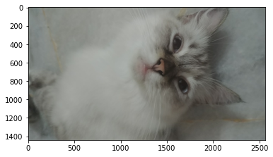
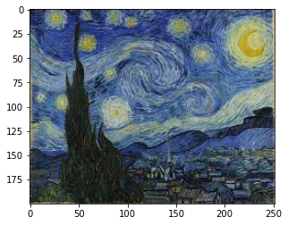
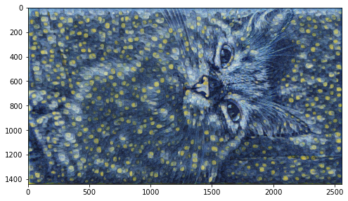

This is just a fun little program for taking a style of an image into another image. We'll be using TensorFlow in this project with a pretrained Neural Style Transfer Model. Make sure to have TensorFlow installed before proceeding.


```python
import tensorflow_hub as hub
import tensorflow as tf
from matplotlib import pyplot as plt
import numpy as np
import cv2
```

# Download Pretrained Model


```python
model = hub.load('https://tfhub.dev/google/magenta/arbitrary-image-stylization-v1-256/2')
```

# Load Image


```python
def load_image(img_path):
    img = tf.io.read_file(img_path)
    img = tf.image.decode_image(img, channels=3)
    img = tf.image.convert_image_dtype(img, tf.float32)
    img = img[tf.newaxis, :]
    return img
```

load_mage function will load and preprocess our image before passing it through the model


```python
content_image = load_image('cat.jpg')
style_image = load_image('starrynight.jfif')
```

# Preview Original Images


```python
content_image.shape
```


    TensorShape([1, 1440, 2560, 3])


```python
plt.imshow(np.squeeze(content_image))
plt.show()
```


    

    


This is the base picture(my lovely cat) that we want to apply our style effect


```python
plt.imshow(np.squeeze(style_image))
plt.show()
```


    

    


This is the image style that we will try to apply on our base picture, which in this case we'll use the Starry Night painting by Vincent van Gogh

# Stylize Image


```python
stylized_image = model(tf.constant(content_image), tf.constant(style_image))[0]
```


```python
fig = plt.figure(figsize=(8, 8))
plt.imshow(np.squeeze(stylized_image))
plt.show()
```


    

    


Voila! here we can see my cat picture but in the style of Vincent van Gogh's Starry Night. Pretty neat huh?

# Export Image

Let's export this image so you can brag how artsy you are on social media!


```python
cv2.imwrite('generated_img.jpg', cv2.cvtColor(np.squeeze(stylized_image)*255, cv2.COLOR_BGR2RGB))
```


    True


