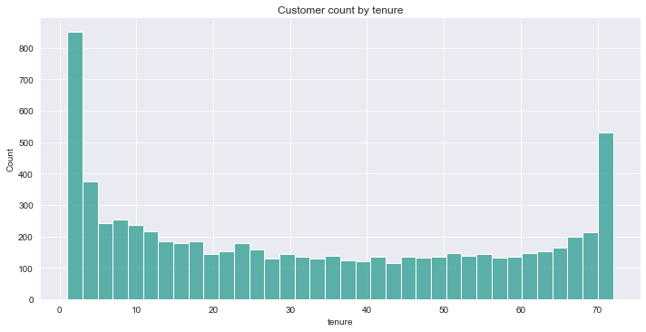
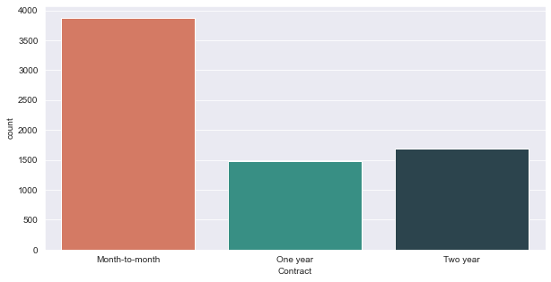
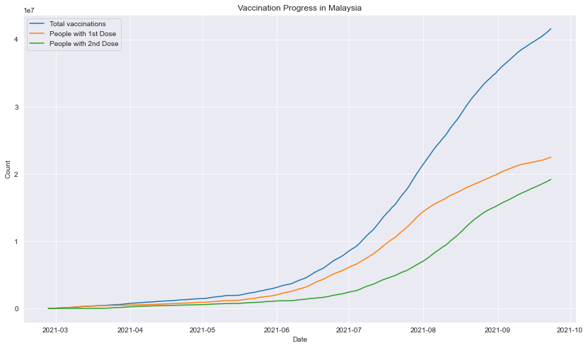
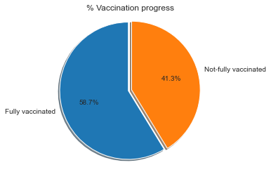
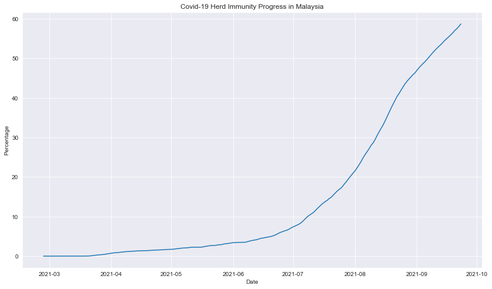
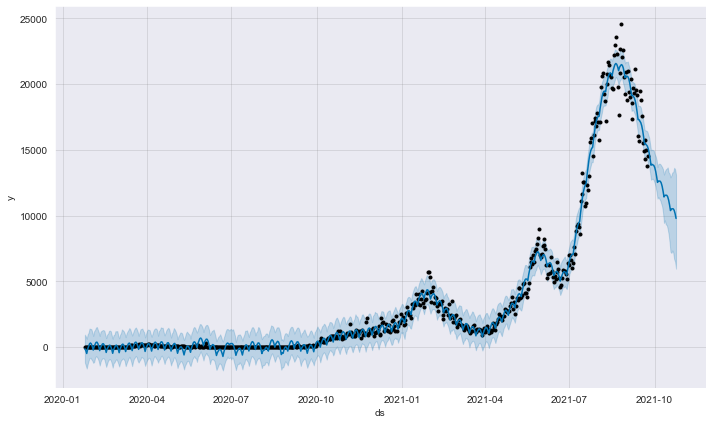
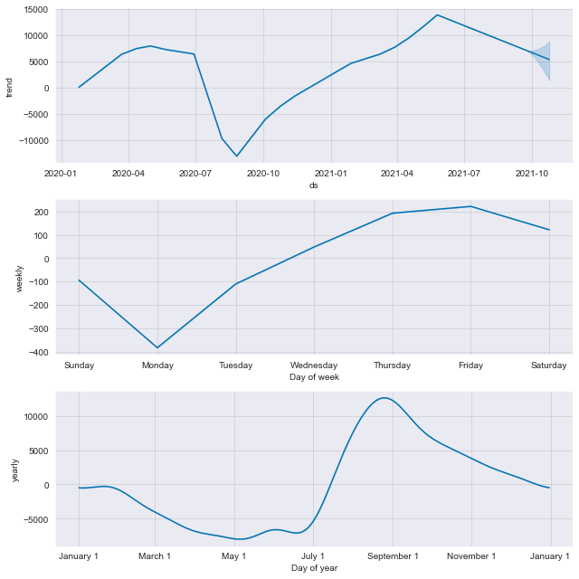

**Notebook contents:**

[**Importing the data**](#import_data)

[**EDA**](#eda)
1. [**Factors that correlates to the number of new cases**](#factor_corr)
* [Data cleaning](#factor_corr_c)
* [Correlation between variables](#corr_var)
* [Dataset variables value over time](#var_time_data)

2. [**Vaccination**](#herd_immunity)
* [Data cleaning](#herd_immunity_c)
* [Plot of vaccination progress in Malaysia](#vac_prog)
* [Percentage of fully vaccinated count against population](#full_vac)
* [Percentage of fully vaccinated count across time](#vac_time)

3. [**Count of new cases by state**](#state_case)
* [Data cleaning](#state_case_c)
* [Plot of new cases for each state over time](#state_case_plot)

4. [**Count of Covid tests by state**](#test_state)
* [Data cleaning](#test_state_c)
* [Plot of total Covid tests by state](#test_state_plot)

[**Covid-19 new cases forecast**](#new_case_proph)
* [Data preparation](#proph_prep)
* [Hyperparameter tuning](#hyperparameter)
* [Forecast new cases](#forc_new)

[**Prediction model**](#pred_model)
* [Data preprocessing](#pred_proc)
* [Training and evaluation](#train_eval)

<a id='import_data'></a>
# Importing the data
Since the data is frequently updated, we will grab the data directly from the site instead of having to download the csv files manually to perform the analysis. The other good part about this is that the analysis done in on the latest data provided.

Datasets are obtained from:

* [Ministry of Health Malaysia Github](https://github.com/MoH-Malaysia/covid19-public/)
* [Our World In Data](https://github.com/owid/covid-19-data/tree/master/public/data/vaccinations)


```python
import pandas as pd
import numpy as np
import io
import requests
```


```python
url="https://raw.githubusercontent.com/MoH-Malaysia/covid19-public/main/epidemic/tests_malaysia.csv"
s=requests.get(url).content
tests=pd.read_csv(io.StringIO(s.decode('utf-8')))
tests.to_csv('dataset/tests_malaysia.csv')
```


```python
url="https://raw.githubusercontent.com/MoH-Malaysia/covid19-public/main/epidemic/cases_malaysia.csv"
s=requests.get(url).content
cases=pd.read_csv(io.StringIO(s.decode('utf-8')))
cases.to_csv('dataset/cases_malaysia.csv')
```


```python
url="https://raw.githubusercontent.com/MoH-Malaysia/covid19-public/main/epidemic/cases_state.csv"
s=requests.get(url).content
state_cases=pd.read_csv(io.StringIO(s.decode('utf-8')))
state_cases.to_csv('dataset/cases_state.csv')
```


```python
url="https://raw.githubusercontent.com/MoH-Malaysia/covid19-public/main/mysejahtera/trace_malaysia.csv"
s=requests.get(url).content
casual_contacts=pd.read_csv(io.StringIO(s.decode('utf-8')))
casual_contacts.to_csv('dataset/trace_malaysia.csv')
```


```python
url="https://raw.githubusercontent.com/MoH-Malaysia/covid19-public/main/epidemic/deaths_malaysia.csv"
s=requests.get(url).content
deaths_public=pd.read_csv(io.StringIO(s.decode('utf-8')))
deaths_public.to_csv('dataset/deaths_malaysia.csv')
```


```python
url="https://raw.githubusercontent.com/MoH-Malaysia/covid19-public/main/epidemic/deaths_state.csv"
s=requests.get(url).content
deaths_state=pd.read_csv(io.StringIO(s.decode('utf-8')))
deaths_state.to_csv('dataset/death_state.csv')
```


```python
url="https://raw.githubusercontent.com/owid/covid-19-data/master/public/data/vaccinations/vaccinations.csv"
s=requests.get(url).content
vaccination_who=pd.read_csv(io.StringIO(s.decode('utf-8')))
vaccination_who.to_csv('dataset/vaccinations.csv')
```


```python
url="https://raw.githubusercontent.com/MoH-Malaysia/covid19-public/main/epidemic/tests_state.csv"
s=requests.get(url).content
tests_state=pd.read_csv(io.StringIO(s.decode('utf-8')))
tests_state.to_csv('dataset/tests_state.csv')
```


```python
url='https://raw.githubusercontent.com/MoH-Malaysia/covid19-public/main/static/population.csv'
s=requests.get(url).content
population=pd.read_csv(io.StringIO(s.decode('utf-8')))
population.to_csv('dataset/population.csv')
```

<a id='eda'></a>
# EDA

<a id='factor_corr'></a>
## 1. Factors that correlates to the number of new cases

<a id='factor_corr_c'></a>
### Data cleaning


```python
#make backup of the original dataframe
df_tests=tests.copy()
df_cases=cases.copy()
df_death_public=deaths_public.copy()
df_casual_contacts=casual_contacts.copy()
```


```python
#preview data
df_cases.tail()
```


<div>
<style scoped>
    .dataframe tbody tr th:only-of-type {
        vertical-align: middle;
    }

    .dataframe tbody tr th {
        vertical-align: top;
    }

    .dataframe thead th {
        text-align: right;
    }
</style>
<table border="1" class="dataframe">
  <thead>
    <tr style="text-align: right;">
      <th></th>
      <th>date</th>
      <th>cases_new</th>
      <th>cases_import</th>
      <th>cases_recovered</th>
      <th>cluster_import</th>
      <th>cluster_religious</th>
      <th>cluster_community</th>
      <th>cluster_highRisk</th>
      <th>cluster_education</th>
      <th>cluster_detentionCentre</th>
      <th>cluster_workplace</th>
    </tr>
  </thead>
  <tbody>
    <tr>
      <th>604</th>
      <td>2021-09-20</td>
      <td>14345</td>
      <td>43</td>
      <td>16814</td>
      <td>24.0</td>
      <td>4.0</td>
      <td>447.0</td>
      <td>7.0</td>
      <td>1.0</td>
      <td>10.0</td>
      <td>523.0</td>
    </tr>
    <tr>
      <th>605</th>
      <td>2021-09-21</td>
      <td>15759</td>
      <td>27</td>
      <td>16650</td>
      <td>0.0</td>
      <td>3.0</td>
      <td>301.0</td>
      <td>45.0</td>
      <td>15.0</td>
      <td>2.0</td>
      <td>622.0</td>
    </tr>
    <tr>
      <th>606</th>
      <td>2021-09-22</td>
      <td>14990</td>
      <td>5</td>
      <td>19702</td>
      <td>0.0</td>
      <td>8.0</td>
      <td>210.0</td>
      <td>35.0</td>
      <td>49.0</td>
      <td>17.0</td>
      <td>595.0</td>
    </tr>
    <tr>
      <th>607</th>
      <td>2021-09-23</td>
      <td>13754</td>
      <td>4</td>
      <td>16628</td>
      <td>0.0</td>
      <td>1.0</td>
      <td>303.0</td>
      <td>20.0</td>
      <td>7.0</td>
      <td>6.0</td>
      <td>658.0</td>
    </tr>
    <tr>
      <th>608</th>
      <td>2021-09-24</td>
      <td>14554</td>
      <td>9</td>
      <td>16751</td>
      <td>0.0</td>
      <td>0.0</td>
      <td>405.0</td>
      <td>45.0</td>
      <td>34.0</td>
      <td>4.0</td>
      <td>582.0</td>
    </tr>
  </tbody>
</table>
</div>


```python
#check for null values
print(df_tests.isna().sum())
print('\n')
print(df_cases.isna().sum())
print('\n')
print(df_casual_contacts.isna().sum())
print('\n')
print(df_death_public.isna().sum())
```

    date      0
    rtk-ag    0
    pcr       0
    dtype: int64
    
    
    date                         0
    cases_new                    0
    cases_import                 0
    cases_recovered              0
    cluster_import             342
    cluster_religious          342
    cluster_community          342
    cluster_highRisk           342
    cluster_education          342
    cluster_detentionCentre    342
    cluster_workplace          342
    dtype: int64
    
    
    date                0
    casual_contacts     0
    hide_large         50
    hide_small         50
    dtype: int64
    
    
    date              0
    deaths_new        0
    deaths_new_dod    0
    deaths_bid        0
    deaths_bid_dod    0
    dtype: int64
    


```python
#check data types
print(df_tests.dtypes)
print('\n')
print(df_cases.dtypes)
print('\n')
print(df_casual_contacts.dtypes)
print('\n')
print(df_death_public.dtypes)
```

    date      object
    rtk-ag     int64
    pcr        int64
    dtype: object
    
    
    date                        object
    cases_new                    int64
    cases_import                 int64
    cases_recovered              int64
    cluster_import             float64
    cluster_religious          float64
    cluster_community          float64
    cluster_highRisk           float64
    cluster_education          float64
    cluster_detentionCentre    float64
    cluster_workplace          float64
    dtype: object
    
    
    date                object
    casual_contacts      int64
    hide_large         float64
    hide_small         float64
    dtype: object
    
    
    date              object
    deaths_new         int64
    deaths_new_dod     int64
    deaths_bid         int64
    deaths_bid_dod     int64
    dtype: object
    


```python
#convert date column into datetime
df_tests['date'] = pd.to_datetime(df_tests['date'])
df_cases['date'] = pd.to_datetime(df_cases['date'])
df_casual_contacts['date'] = pd.to_datetime(df_casual_contacts['date'])
df_death_public['date'] = pd.to_datetime(df_cases['date'])
```


```python
#create dataframe with selected columns
df_cases_new=df_cases[['date','cases_new']]
df_casual_contacts=df_casual_contacts[['date','casual_contacts']]
df_death_total=df_death_public[['date','deaths_new']]
```


```python
#merge dataframes
new_cases_and_tests =pd.merge(df_cases_new,df_tests,on="date", how='right')
test_cases_contacts =pd.merge(new_cases_and_tests,df_casual_contacts,on="date",how='left')
df_merged =pd.merge(test_cases_contacts,df_death_total,on="date",how='left')
```


```python
#preview merged dataframe
df_merged.tail()
```


<div>
<style scoped>
    .dataframe tbody tr th:only-of-type {
        vertical-align: middle;
    }

    .dataframe tbody tr th {
        vertical-align: top;
    }

    .dataframe thead th {
        text-align: right;
    }
</style>
<table border="1" class="dataframe">
  <thead>
    <tr style="text-align: right;">
      <th></th>
      <th>date</th>
      <th>cases_new</th>
      <th>rtk-ag</th>
      <th>pcr</th>
      <th>casual_contacts</th>
      <th>deaths_new</th>
    </tr>
  </thead>
  <tbody>
    <tr>
      <th>603</th>
      <td>2021-09-18</td>
      <td>15549.0</td>
      <td>53716</td>
      <td>51101</td>
      <td>35972.0</td>
      <td>NaN</td>
    </tr>
    <tr>
      <th>604</th>
      <td>2021-09-19</td>
      <td>14954.0</td>
      <td>70816</td>
      <td>38498</td>
      <td>35812.0</td>
      <td>NaN</td>
    </tr>
    <tr>
      <th>605</th>
      <td>2021-09-20</td>
      <td>14345.0</td>
      <td>120160</td>
      <td>45337</td>
      <td>44788.0</td>
      <td>NaN</td>
    </tr>
    <tr>
      <th>606</th>
      <td>2021-09-21</td>
      <td>15759.0</td>
      <td>110875</td>
      <td>52789</td>
      <td>41393.0</td>
      <td>NaN</td>
    </tr>
    <tr>
      <th>607</th>
      <td>2021-09-22</td>
      <td>14990.0</td>
      <td>127625</td>
      <td>48687</td>
      <td>44965.0</td>
      <td>NaN</td>
    </tr>
  </tbody>
</table>
</div>


```python
#check for null values
df_merged.isna().sum()
```


    date                 0
    cases_new            1
    rtk-ag               0
    pcr                  0
    casual_contacts    402
    deaths_new          51
    dtype: int64


```python
#handling null values
#Since theres a substantial amount of missing values,
#we will use iterative imputer. It will estimate the values according to the featues.

from sklearn.experimental import enable_iterative_imputer
from sklearn.impute import IterativeImputer
from sklearn.linear_model import LinearRegression
x=df_merged[['cases_new','casual_contacts','pcr','rtk-ag','deaths_new']]

it_imputer = IterativeImputer(min_value = 0)
y=it_imputer.fit_transform(x)

y = pd.DataFrame(y, columns = x.columns)
pd.DataFrame(y)

cleaned_df =pd.merge(y,df_merged['date'], left_index=True, right_index=True)

pd.DataFrame(cleaned_df)
```


<div>
<style scoped>
    .dataframe tbody tr th:only-of-type {
        vertical-align: middle;
    }

    .dataframe tbody tr th {
        vertical-align: top;
    }

    .dataframe thead th {
        text-align: right;
    }
</style>
<table border="1" class="dataframe">
  <thead>
    <tr style="text-align: right;">
      <th></th>
      <th>cases_new</th>
      <th>casual_contacts</th>
      <th>pcr</th>
      <th>rtk-ag</th>
      <th>deaths_new</th>
      <th>date</th>
    </tr>
  </thead>
  <tbody>
    <tr>
      <th>0</th>
      <td>0.0</td>
      <td>708.061210</td>
      <td>2.0</td>
      <td>0.0</td>
      <td>0.000000</td>
      <td>2020-01-24</td>
    </tr>
    <tr>
      <th>1</th>
      <td>4.0</td>
      <td>713.251588</td>
      <td>5.0</td>
      <td>0.0</td>
      <td>2.000000</td>
      <td>2020-01-25</td>
    </tr>
    <tr>
      <th>2</th>
      <td>0.0</td>
      <td>710.942841</td>
      <td>14.0</td>
      <td>0.0</td>
      <td>0.000000</td>
      <td>2020-01-26</td>
    </tr>
    <tr>
      <th>3</th>
      <td>0.0</td>
      <td>713.344200</td>
      <td>24.0</td>
      <td>0.0</td>
      <td>0.000000</td>
      <td>2020-01-27</td>
    </tr>
    <tr>
      <th>4</th>
      <td>0.0</td>
      <td>720.222053</td>
      <td>53.0</td>
      <td>0.0</td>
      <td>1.000000</td>
      <td>2020-01-28</td>
    </tr>
    <tr>
      <th>...</th>
      <td>...</td>
      <td>...</td>
      <td>...</td>
      <td>...</td>
      <td>...</td>
      <td>...</td>
    </tr>
    <tr>
      <th>603</th>
      <td>15549.0</td>
      <td>35972.000000</td>
      <td>51101.0</td>
      <td>53716.0</td>
      <td>408.310762</td>
      <td>2021-09-18</td>
    </tr>
    <tr>
      <th>604</th>
      <td>14954.0</td>
      <td>35812.000000</td>
      <td>38498.0</td>
      <td>70816.0</td>
      <td>383.149210</td>
      <td>2021-09-19</td>
    </tr>
    <tr>
      <th>605</th>
      <td>14345.0</td>
      <td>44788.000000</td>
      <td>45337.0</td>
      <td>120160.0</td>
      <td>336.497232</td>
      <td>2021-09-20</td>
    </tr>
    <tr>
      <th>606</th>
      <td>15759.0</td>
      <td>41393.000000</td>
      <td>52789.0</td>
      <td>110875.0</td>
      <td>386.767446</td>
      <td>2021-09-21</td>
    </tr>
    <tr>
      <th>607</th>
      <td>14990.0</td>
      <td>44965.000000</td>
      <td>48687.0</td>
      <td>127625.0</td>
      <td>353.002695</td>
      <td>2021-09-22</td>
    </tr>
  </tbody>
</table>
<p>608 rows × 6 columns</p>
</div>


```python
#convert numerical values to integer
cleaned_df[['cases_new','casual_contacts','pcr', 'rtk-ag','deaths_new']]=cleaned_df[['cases_new','casual_contacts','pcr', 'rtk-ag','deaths_new']].astype(int)
```


```python
#sort values by date
cleaned_df.sort_values(by='date',ascending=True)
```


<div>
<style scoped>
    .dataframe tbody tr th:only-of-type {
        vertical-align: middle;
    }

    .dataframe tbody tr th {
        vertical-align: top;
    }

    .dataframe thead th {
        text-align: right;
    }
</style>
<table border="1" class="dataframe">
  <thead>
    <tr style="text-align: right;">
      <th></th>
      <th>cases_new</th>
      <th>casual_contacts</th>
      <th>pcr</th>
      <th>rtk-ag</th>
      <th>deaths_new</th>
      <th>date</th>
    </tr>
  </thead>
  <tbody>
    <tr>
      <th>0</th>
      <td>0</td>
      <td>708</td>
      <td>2</td>
      <td>0</td>
      <td>0</td>
      <td>2020-01-24</td>
    </tr>
    <tr>
      <th>1</th>
      <td>4</td>
      <td>713</td>
      <td>5</td>
      <td>0</td>
      <td>2</td>
      <td>2020-01-25</td>
    </tr>
    <tr>
      <th>2</th>
      <td>0</td>
      <td>710</td>
      <td>14</td>
      <td>0</td>
      <td>0</td>
      <td>2020-01-26</td>
    </tr>
    <tr>
      <th>3</th>
      <td>0</td>
      <td>713</td>
      <td>24</td>
      <td>0</td>
      <td>0</td>
      <td>2020-01-27</td>
    </tr>
    <tr>
      <th>4</th>
      <td>0</td>
      <td>720</td>
      <td>53</td>
      <td>0</td>
      <td>1</td>
      <td>2020-01-28</td>
    </tr>
    <tr>
      <th>...</th>
      <td>...</td>
      <td>...</td>
      <td>...</td>
      <td>...</td>
      <td>...</td>
      <td>...</td>
    </tr>
    <tr>
      <th>603</th>
      <td>15549</td>
      <td>35972</td>
      <td>51101</td>
      <td>53716</td>
      <td>408</td>
      <td>2021-09-18</td>
    </tr>
    <tr>
      <th>604</th>
      <td>14954</td>
      <td>35812</td>
      <td>38498</td>
      <td>70816</td>
      <td>383</td>
      <td>2021-09-19</td>
    </tr>
    <tr>
      <th>605</th>
      <td>14345</td>
      <td>44788</td>
      <td>45337</td>
      <td>120160</td>
      <td>336</td>
      <td>2021-09-20</td>
    </tr>
    <tr>
      <th>606</th>
      <td>15759</td>
      <td>41393</td>
      <td>52789</td>
      <td>110875</td>
      <td>386</td>
      <td>2021-09-21</td>
    </tr>
    <tr>
      <th>607</th>
      <td>14990</td>
      <td>44965</td>
      <td>48687</td>
      <td>127625</td>
      <td>353</td>
      <td>2021-09-22</td>
    </tr>
  </tbody>
</table>
<p>608 rows × 6 columns</p>
</div>


### Visualization


```python
import seaborn as sns
import matplotlib.pyplot as plt

sns.set_style("darkgrid")
```

<a id='corr_var'></a>
#### Correlation between variables


```python
#plot correlation heatmap
corr=cleaned_df.corr()
plt.figure(figsize=(8,8))

sns.heatmap(corr,annot=True,vmin=-1.0, cmap='mako')
plt.title('Correlation Heatmap')
plt.show()
```


    

    


**Description:** From the correlation matrix, we can see that there is a high positive correlation between death and new cases. This shows that as the count of new cases increase, the reported new death cases also increases. The amount of new cases is also have a high correlation with the amount of testing done. Among the two tests, rtk-ag test have a higher correlation coefficient than pcr. This may show that there are more positive cases reported by rtk-ag in comparison with pcr. Casual contacts also have a high correlation to the amount of new cases. This shows that casual contacts contributes to the amount of new covid cases.

<a id='var_time_data'></a>
#### Dataset variables value over time


```python
#plot multiple line graph
fig=plt.figure(figsize=(14,8))
plt.title('Dataset variables value over time')
plt.xticks(rotation=0)
sns.lineplot(data=pd.melt(cleaned_df, 'date'), x="date", y='value',hue='variable',palette='husl')
plt.legend()

plt.xlabel('Date')
plt.ylabel('Count')

plt.show()
```


    

    


**Description:** From the plot, we can see that the variables are having an upward trend as time progress. Notice the presence some occasional dips in the number of casual contacts everytime cases hits an all new time high which possibly due to the implementation of stricter Movement Control Order where people are refrained from travelling and even going out. This can be further seen on the filtered linegraph below.


```python
#plot multiple line graph
fig=plt.figure(figsize=(14,8))
plt.title('Casual contacts and new cases ')
plt.xticks(rotation=0)

colors = ["#FF0B04", "#4374B3"]


sns.lineplot(data=pd.melt(cleaned_df[['cases_new','casual_contacts','date']], 'date'),
             x="date",
             y='value',
             hue='variable',
             palette=colors
            )

plt.xlabel('Date')
plt.ylabel('Count')

plt.show()
```


    

    


**Description:** Here we can have a clearer view on the occasional dips in the number of casual contacts everytime cases hits an all new time high as mentioned from the previous description.

<a id='herd_immunity'></a>
## 2. Vaccination

Based on the government's target, we need to have 80% of the population fully vaccinated against Covid-19 in order to achieve herd immunity.

<a id='herd_immunity_c'></a>
### Data cleaning


```python
#make a backup of the dataframe
df_vaccination = vaccination_who.copy()
df_population = population.copy()
```


```python
#preview the dataframe
df_vaccination.head()
```


<div>
<style scoped>
    .dataframe tbody tr th:only-of-type {
        vertical-align: middle;
    }

    .dataframe tbody tr th {
        vertical-align: top;
    }

    .dataframe thead th {
        text-align: right;
    }
</style>
<table border="1" class="dataframe">
  <thead>
    <tr style="text-align: right;">
      <th></th>
      <th>location</th>
      <th>iso_code</th>
      <th>date</th>
      <th>total_vaccinations</th>
      <th>people_vaccinated</th>
      <th>people_fully_vaccinated</th>
      <th>total_boosters</th>
      <th>daily_vaccinations_raw</th>
      <th>daily_vaccinations</th>
      <th>total_vaccinations_per_hundred</th>
      <th>people_vaccinated_per_hundred</th>
      <th>people_fully_vaccinated_per_hundred</th>
      <th>total_boosters_per_hundred</th>
      <th>daily_vaccinations_per_million</th>
    </tr>
  </thead>
  <tbody>
    <tr>
      <th>0</th>
      <td>Afghanistan</td>
      <td>AFG</td>
      <td>2021-02-22</td>
      <td>0.0</td>
      <td>0.0</td>
      <td>NaN</td>
      <td>NaN</td>
      <td>NaN</td>
      <td>NaN</td>
      <td>0.0</td>
      <td>0.0</td>
      <td>NaN</td>
      <td>NaN</td>
      <td>NaN</td>
    </tr>
    <tr>
      <th>1</th>
      <td>Afghanistan</td>
      <td>AFG</td>
      <td>2021-02-23</td>
      <td>NaN</td>
      <td>NaN</td>
      <td>NaN</td>
      <td>NaN</td>
      <td>NaN</td>
      <td>1367.0</td>
      <td>NaN</td>
      <td>NaN</td>
      <td>NaN</td>
      <td>NaN</td>
      <td>34.0</td>
    </tr>
    <tr>
      <th>2</th>
      <td>Afghanistan</td>
      <td>AFG</td>
      <td>2021-02-24</td>
      <td>NaN</td>
      <td>NaN</td>
      <td>NaN</td>
      <td>NaN</td>
      <td>NaN</td>
      <td>1367.0</td>
      <td>NaN</td>
      <td>NaN</td>
      <td>NaN</td>
      <td>NaN</td>
      <td>34.0</td>
    </tr>
    <tr>
      <th>3</th>
      <td>Afghanistan</td>
      <td>AFG</td>
      <td>2021-02-25</td>
      <td>NaN</td>
      <td>NaN</td>
      <td>NaN</td>
      <td>NaN</td>
      <td>NaN</td>
      <td>1367.0</td>
      <td>NaN</td>
      <td>NaN</td>
      <td>NaN</td>
      <td>NaN</td>
      <td>34.0</td>
    </tr>
    <tr>
      <th>4</th>
      <td>Afghanistan</td>
      <td>AFG</td>
      <td>2021-02-26</td>
      <td>NaN</td>
      <td>NaN</td>
      <td>NaN</td>
      <td>NaN</td>
      <td>NaN</td>
      <td>1367.0</td>
      <td>NaN</td>
      <td>NaN</td>
      <td>NaN</td>
      <td>NaN</td>
      <td>34.0</td>
    </tr>
  </tbody>
</table>
</div>


```python
#preview the dataframe
df_population.head()
```


<div>
<style scoped>
    .dataframe tbody tr th:only-of-type {
        vertical-align: middle;
    }

    .dataframe tbody tr th {
        vertical-align: top;
    }

    .dataframe thead th {
        text-align: right;
    }
</style>
<table border="1" class="dataframe">
  <thead>
    <tr style="text-align: right;">
      <th></th>
      <th>state</th>
      <th>idxs</th>
      <th>pop</th>
      <th>pop_18</th>
      <th>pop_60</th>
      <th>pop_12</th>
    </tr>
  </thead>
  <tbody>
    <tr>
      <th>0</th>
      <td>Malaysia</td>
      <td>0</td>
      <td>32657400</td>
      <td>23409600</td>
      <td>3502000</td>
      <td>3147500</td>
    </tr>
    <tr>
      <th>1</th>
      <td>Johor</td>
      <td>1</td>
      <td>3781000</td>
      <td>2711900</td>
      <td>428700</td>
      <td>359900</td>
    </tr>
    <tr>
      <th>2</th>
      <td>Kedah</td>
      <td>2</td>
      <td>2185100</td>
      <td>1540600</td>
      <td>272500</td>
      <td>211400</td>
    </tr>
    <tr>
      <th>3</th>
      <td>Kelantan</td>
      <td>3</td>
      <td>1906700</td>
      <td>1236200</td>
      <td>194100</td>
      <td>210600</td>
    </tr>
    <tr>
      <th>4</th>
      <td>Melaka</td>
      <td>4</td>
      <td>932700</td>
      <td>677400</td>
      <td>118500</td>
      <td>86500</td>
    </tr>
  </tbody>
</table>
</div>


```python
#filter column and rows with data for Malaysia
df_population = df_population[df_population['state']=='Malaysia']
df_vaccination = df_vaccination[df_vaccination['iso_code'] =='MYS']
```


```python
#create new dataframe with selected columns
df_vax_col = df_vaccination[['date', 'total_vaccinations', 'people_vaccinated' , 'people_fully_vaccinated','daily_vaccinations']]
```


```python
#convert date column to datetime
df_vax_col['date'] = pd.to_datetime(df_vax_col['date'])
```

    <ipython-input-32-087e617b6292>:2: SettingWithCopyWarning: 
    A value is trying to be set on a copy of a slice from a DataFrame.
    Try using .loc[row_indexer,col_indexer] = value instead
    
    See the caveats in the documentation: https://pandas.pydata.org/pandas-docs/stable/user_guide/indexing.html#returning-a-view-versus-a-copy
      df_vax_col['date'] = pd.to_datetime(df_vax_col['date'])
    


```python
#check for null values
print(df_vax_col.isna().sum())
```

    date                       0
    total_vaccinations         0
    people_vaccinated          0
    people_fully_vaccinated    2
    daily_vaccinations         1
    dtype: int64
    


```python
#drop null rows
df_vax_col.dropna(inplace=True)
```

    <ipython-input-34-ef025bb1d682>:2: SettingWithCopyWarning: 
    A value is trying to be set on a copy of a slice from a DataFrame
    
    See the caveats in the documentation: https://pandas.pydata.org/pandas-docs/stable/user_guide/indexing.html#returning-a-view-versus-a-copy
      df_vax_col.dropna(inplace=True)
    


```python
#preview dataframe
df_vax_col.tail()
```


<div>
<style scoped>
    .dataframe tbody tr th:only-of-type {
        vertical-align: middle;
    }

    .dataframe tbody tr th {
        vertical-align: top;
    }

    .dataframe thead th {
        text-align: right;
    }
</style>
<table border="1" class="dataframe">
  <thead>
    <tr style="text-align: right;">
      <th></th>
      <th>date</th>
      <th>total_vaccinations</th>
      <th>people_vaccinated</th>
      <th>people_fully_vaccinated</th>
      <th>daily_vaccinations</th>
    </tr>
  </thead>
  <tbody>
    <tr>
      <th>27655</th>
      <td>2021-09-19</td>
      <td>40375056.0</td>
      <td>22003333.0</td>
      <td>18453322.0</td>
      <td>230267.0</td>
    </tr>
    <tr>
      <th>27656</th>
      <td>2021-09-20</td>
      <td>40664674.0</td>
      <td>22099719.0</td>
      <td>18648795.0</td>
      <td>239191.0</td>
    </tr>
    <tr>
      <th>27657</th>
      <td>2021-09-21</td>
      <td>40925929.0</td>
      <td>22226325.0</td>
      <td>18786636.0</td>
      <td>241660.0</td>
    </tr>
    <tr>
      <th>27658</th>
      <td>2021-09-22</td>
      <td>41247271.0</td>
      <td>22351561.0</td>
      <td>18986347.0</td>
      <td>252022.0</td>
    </tr>
    <tr>
      <th>27659</th>
      <td>2021-09-23</td>
      <td>41573883.0</td>
      <td>22482988.0</td>
      <td>19180397.0</td>
      <td>269781.0</td>
    </tr>
  </tbody>
</table>
</div>


### Visualization


```python
#create pandas series from column
df_pop = df_population['pop']
```


```python
#merge dataframes
df_vax_herd = df_vax_col.merge(df_pop, how='cross')
```


```python
#preview dataframes
df_vax_col.tail()
```


<div>
<style scoped>
    .dataframe tbody tr th:only-of-type {
        vertical-align: middle;
    }

    .dataframe tbody tr th {
        vertical-align: top;
    }

    .dataframe thead th {
        text-align: right;
    }
</style>
<table border="1" class="dataframe">
  <thead>
    <tr style="text-align: right;">
      <th></th>
      <th>date</th>
      <th>total_vaccinations</th>
      <th>people_vaccinated</th>
      <th>people_fully_vaccinated</th>
      <th>daily_vaccinations</th>
    </tr>
  </thead>
  <tbody>
    <tr>
      <th>27655</th>
      <td>2021-09-19</td>
      <td>40375056.0</td>
      <td>22003333.0</td>
      <td>18453322.0</td>
      <td>230267.0</td>
    </tr>
    <tr>
      <th>27656</th>
      <td>2021-09-20</td>
      <td>40664674.0</td>
      <td>22099719.0</td>
      <td>18648795.0</td>
      <td>239191.0</td>
    </tr>
    <tr>
      <th>27657</th>
      <td>2021-09-21</td>
      <td>40925929.0</td>
      <td>22226325.0</td>
      <td>18786636.0</td>
      <td>241660.0</td>
    </tr>
    <tr>
      <th>27658</th>
      <td>2021-09-22</td>
      <td>41247271.0</td>
      <td>22351561.0</td>
      <td>18986347.0</td>
      <td>252022.0</td>
    </tr>
    <tr>
      <th>27659</th>
      <td>2021-09-23</td>
      <td>41573883.0</td>
      <td>22482988.0</td>
      <td>19180397.0</td>
      <td>269781.0</td>
    </tr>
  </tbody>
</table>
</div>


<a id='vac_prog'></a>
#### Plot of vaccination progress in Malaysia


```python
#plot multiple line graph
fig=plt.figure(figsize=(14,8))

date = df_vax_herd['date']
sns.lineplot(x=date, y=df_vax_herd['total_vaccinations'], label = "Total vaccinations")
sns.lineplot(x=date, y=df_vax_herd['people_vaccinated'], label = "People with 1st Dose")
sns.lineplot(x=date, y=df_vax_herd['people_fully_vaccinated'], label = "People with 2nd Dose")

plt.title('Vaccination Progress in Malaysia')

plt.xlabel('Date')
plt.ylabel('Count')

plt.show()
```


    

    


<a id='full_vac'></a>
#### Percentage of fully vaccinated count against population


```python
#calculate current herd immunity percentage
vax_pop = (df_vax_herd['people_fully_vaccinated'].iloc[-1:,] / df_vax_herd['pop'].iloc[-1:,]) * 100
```


```python
#plot pie chart
import matplotlib.ticker as mtick

np_vax=(100-vax_pop)
a =float(vax_pop)
b =float(np_vax)
explode = [0.0,0.05]
labels = 'Fully vaccinated', 'Not-fully vaccinated'
sizes = [a,b]

fig1, ax1 = plt.subplots()
ax1.pie(sizes, explode=explode, labels=labels, autopct='%1.1f%%',
        shadow=True, startangle=90)
ax1.yaxis.set_major_formatter(mtick.PercentFormatter())
ax1.axis('equal')

ax1.set_title('% Vaccination progress')

plt.show()
```


    

    


<a id='vac_time'></a>
#### Percentage of fully vaccinated count across time


```python
#calculate herd immunity percentage
df_vax_herd['vax_percentage'] = (df_vax_herd['people_fully_vaccinated'] / df_vax_herd['pop']) * 100
```


```python
#plot line graph
fig=plt.figure(figsize=(14,8))

sns.lineplot(data=df_vax_herd,x=df_vax_herd['date'],y=df_vax_herd['vax_percentage'])
plt.title("Covid-19 Herd Immunity Progress in Malaysia")
plt.xlabel("Date")
plt.ylabel("Percentage")
plt.show()
```


    

    


**Description:** The vaccine admnistration had exponentially increased with a slight decreased rate aproaching September 2021.

<a id='state_case'></a>
## 3. Count of new cases by state

<a id='state_case_c'></a>
### Data Cleaning


```python
#create a copy of the original datafarme
df_state_cases=state_cases.copy()
df_death_public=deaths_public.copy()
df_death_state=deaths_state.copy()
```


```python
#preview dataframe
df_state_cases.head()
```


<div>
<style scoped>
    .dataframe tbody tr th:only-of-type {
        vertical-align: middle;
    }

    .dataframe tbody tr th {
        vertical-align: top;
    }

    .dataframe thead th {
        text-align: right;
    }
</style>
<table border="1" class="dataframe">
  <thead>
    <tr style="text-align: right;">
      <th></th>
      <th>date</th>
      <th>state</th>
      <th>cases_import</th>
      <th>cases_new</th>
      <th>cases_recovered</th>
    </tr>
  </thead>
  <tbody>
    <tr>
      <th>0</th>
      <td>2020-01-25</td>
      <td>Johor</td>
      <td>4</td>
      <td>4</td>
      <td>0</td>
    </tr>
    <tr>
      <th>1</th>
      <td>2020-01-25</td>
      <td>Kedah</td>
      <td>0</td>
      <td>0</td>
      <td>0</td>
    </tr>
    <tr>
      <th>2</th>
      <td>2020-01-25</td>
      <td>Kelantan</td>
      <td>0</td>
      <td>0</td>
      <td>0</td>
    </tr>
    <tr>
      <th>3</th>
      <td>2020-01-25</td>
      <td>Melaka</td>
      <td>0</td>
      <td>0</td>
      <td>0</td>
    </tr>
    <tr>
      <th>4</th>
      <td>2020-01-25</td>
      <td>Negeri Sembilan</td>
      <td>0</td>
      <td>0</td>
      <td>0</td>
    </tr>
  </tbody>
</table>
</div>


```python
#convert date to datetime
df_state_cases['date'] = pd.to_datetime(df_state_cases['date'])
df_death_public['date'] = pd.to_datetime(df_death_public['date'])
df_death_state['date'] = pd.to_datetime(df_death_state['date'])
```


```python
#check for null values
df_state_cases.isna().sum()
```


    date               0
    state              0
    cases_import       0
    cases_new          0
    cases_recovered    0
    dtype: int64


### Visualization

<a id='state_case_plot'></a>
#### Plot of new cases for each state over time


```python
#scatter plot values over time
fig=plt.figure(figsize=(14,8))
plt.title("Covid cases according to state")

sns.scatterplot(y='cases_new', x='date',hue='state',size="state",data=df_state_cases)

plt.xlabel('Date')
plt.ylabel('Count of new cases')

plt.show()
```


    

    


**Description:** The plot shows that Selangor had significatly more cases throughout the time.Around April 2021, there is a low dip after the second ATH that occured around February 2021, and continued to increase exponantially going forward until August before droping to lower count of new cases.

<a id='test_state'></a>
## 4. Count of Covid tests by state

<a id='test_state_c'></a>
### Data cleaning


```python
#make a copy of the dataframe
df_tests_state = tests_state.copy()
```


```python
#create sum of tests by state
df_ts = df_tests_state.groupby(['state']).sum()
```


```python
#reset index
df_ts.reset_index(inplace=True)
```


```python
#create new column with sum of both testing values
df_ts['total_test'] = (df_ts['rtk-ag'] + df_ts['pcr'])
```

### Visualization

<a id='test_state_plot'></a>
#### Plot of total Covid tests by state


```python
#plot bar chart
fig=plt.figure(figsize=(14,8))
plt.title("Covid Tests by State")
sns.barplot(x="state", y="total_test", data=df_ts)
plt.xlabel('State')
plt.ylabel('Sum of Covid Tests')
plt.xticks(rotation=45)
plt.show()
```


    

    


**Description:** From the Covid Tests by State plot, we can see the top 3 states that have run the most test are Selangor, Johor, and, Sarawak. Despite being near to the Selangor state, W.P Putrajaya had significatly fewer tests done in the area.

<a id='new_case_proph'></a>
# Covid-19 new cases forecast

<a id='proph_prep'></a>
### Data preparation


```python
#Prophet Dependencies
#!pip install pystan==2.19.1.1
#!pip install prophet
```


```python
#if unable to install
#conda install --override-channels -c main -c conda-forge boost
```


```python
#import prophet
from prophet import Prophet
```

    Importing plotly failed. Interactive plots will not work.
    


```python
#make a copy of the original dataframe
pdf = df_cases.copy()
pdf.tail()
```


<div>
<style scoped>
    .dataframe tbody tr th:only-of-type {
        vertical-align: middle;
    }

    .dataframe tbody tr th {
        vertical-align: top;
    }

    .dataframe thead th {
        text-align: right;
    }
</style>
<table border="1" class="dataframe">
  <thead>
    <tr style="text-align: right;">
      <th></th>
      <th>date</th>
      <th>cases_new</th>
      <th>cases_import</th>
      <th>cases_recovered</th>
      <th>cluster_import</th>
      <th>cluster_religious</th>
      <th>cluster_community</th>
      <th>cluster_highRisk</th>
      <th>cluster_education</th>
      <th>cluster_detentionCentre</th>
      <th>cluster_workplace</th>
    </tr>
  </thead>
  <tbody>
    <tr>
      <th>604</th>
      <td>2021-09-20</td>
      <td>14345</td>
      <td>43</td>
      <td>16814</td>
      <td>24.0</td>
      <td>4.0</td>
      <td>447.0</td>
      <td>7.0</td>
      <td>1.0</td>
      <td>10.0</td>
      <td>523.0</td>
    </tr>
    <tr>
      <th>605</th>
      <td>2021-09-21</td>
      <td>15759</td>
      <td>27</td>
      <td>16650</td>
      <td>0.0</td>
      <td>3.0</td>
      <td>301.0</td>
      <td>45.0</td>
      <td>15.0</td>
      <td>2.0</td>
      <td>622.0</td>
    </tr>
    <tr>
      <th>606</th>
      <td>2021-09-22</td>
      <td>14990</td>
      <td>5</td>
      <td>19702</td>
      <td>0.0</td>
      <td>8.0</td>
      <td>210.0</td>
      <td>35.0</td>
      <td>49.0</td>
      <td>17.0</td>
      <td>595.0</td>
    </tr>
    <tr>
      <th>607</th>
      <td>2021-09-23</td>
      <td>13754</td>
      <td>4</td>
      <td>16628</td>
      <td>0.0</td>
      <td>1.0</td>
      <td>303.0</td>
      <td>20.0</td>
      <td>7.0</td>
      <td>6.0</td>
      <td>658.0</td>
    </tr>
    <tr>
      <th>608</th>
      <td>2021-09-24</td>
      <td>14554</td>
      <td>9</td>
      <td>16751</td>
      <td>0.0</td>
      <td>0.0</td>
      <td>405.0</td>
      <td>45.0</td>
      <td>34.0</td>
      <td>4.0</td>
      <td>582.0</td>
    </tr>
  </tbody>
</table>
</div>


```python
#check data types of the dataframe columns
pdf.dtypes
```


    date                       datetime64[ns]
    cases_new                           int64
    cases_import                        int64
    cases_recovered                     int64
    cluster_import                    float64
    cluster_religious                 float64
    cluster_community                 float64
    cluster_highRisk                  float64
    cluster_education                 float64
    cluster_detentionCentre           float64
    cluster_workplace                 float64
    dtype: object


```python
#create y and ds dataframe
pdf=pdf[['cases_new','date']]
pdf.columns = ['y', 'ds']
```


```python
#preview the dataframe
pdf.tail()
```


<div>
<style scoped>
    .dataframe tbody tr th:only-of-type {
        vertical-align: middle;
    }

    .dataframe tbody tr th {
        vertical-align: top;
    }

    .dataframe thead th {
        text-align: right;
    }
</style>
<table border="1" class="dataframe">
  <thead>
    <tr style="text-align: right;">
      <th></th>
      <th>y</th>
      <th>ds</th>
    </tr>
  </thead>
  <tbody>
    <tr>
      <th>604</th>
      <td>14345</td>
      <td>2021-09-20</td>
    </tr>
    <tr>
      <th>605</th>
      <td>15759</td>
      <td>2021-09-21</td>
    </tr>
    <tr>
      <th>606</th>
      <td>14990</td>
      <td>2021-09-22</td>
    </tr>
    <tr>
      <th>607</th>
      <td>13754</td>
      <td>2021-09-23</td>
    </tr>
    <tr>
      <th>608</th>
      <td>14554</td>
      <td>2021-09-24</td>
    </tr>
  </tbody>
</table>
</div>


<a id='hyperparameter'></a>
### Hyperparameter tuning


```python
#hyperparameter tuning

import itertools    
from prophet.diagnostics import cross_validation
from prophet.diagnostics import performance_metrics


#cutoffs = pd.to_datetime(['2013-02-15', '2013-08-15', '2014-02-15'])

param_grid = {  
    'changepoint_prior_scale': [0.001, 0.01, 0.1, 0.5],
    'seasonality_prior_scale': [0.01, 0.1, 1.0, 10.0],
}

# Generate all combinations of parameters
all_params = [dict(zip(param_grid.keys(), v)) for v in itertools.product(*param_grid.values())]
rmses = []  # Store the RMSEs for each params here

# Use cross validation to evaluate all parameters
for params in all_params:
    m = Prophet(**params).fit(pdf)  # Fit model with given params
    df_cv = cross_validation(m, initial='467 days', horizon='90 days', parallel="processes")
    df_p = performance_metrics(df_cv, rolling_window=1)
    rmses.append(df_p['rmse'].values[0])

# Find the best parameters
tuning_results = pd.DataFrame(all_params)
tuning_results['rmse'] = rmses
print(tuning_results)
```

    INFO:prophet:Disabling yearly seasonality. Run prophet with yearly_seasonality=True to override this.
    INFO:prophet:Disabling daily seasonality. Run prophet with daily_seasonality=True to override this.
    WARNING:prophet.models:Optimization terminated abnormally. Falling back to Newton.
    INFO:prophet:Making 2 forecasts with cutoffs between 2021-05-12 00:00:00 and 2021-06-26 00:00:00
    INFO:prophet:Applying in parallel with <concurrent.futures.process.ProcessPoolExecutor object at 0x000002CAF3C275B0>
    INFO:prophet:Disabling yearly seasonality. Run prophet with yearly_seasonality=True to override this.
    INFO:prophet:Disabling daily seasonality. Run prophet with daily_seasonality=True to override this.
    WARNING:prophet.models:Optimization terminated abnormally. Falling back to Newton.
    INFO:prophet:Making 2 forecasts with cutoffs between 2021-05-12 00:00:00 and 2021-06-26 00:00:00
    INFO:prophet:Applying in parallel with <concurrent.futures.process.ProcessPoolExecutor object at 0x000002CAF3B36820>
    INFO:prophet:Disabling yearly seasonality. Run prophet with yearly_seasonality=True to override this.
    INFO:prophet:Disabling daily seasonality. Run prophet with daily_seasonality=True to override this.
    WARNING:prophet.models:Optimization terminated abnormally. Falling back to Newton.
    INFO:prophet:Making 2 forecasts with cutoffs between 2021-05-12 00:00:00 and 2021-06-26 00:00:00
    INFO:prophet:Applying in parallel with <concurrent.futures.process.ProcessPoolExecutor object at 0x000002CAF3AD8C40>
    INFO:prophet:Disabling yearly seasonality. Run prophet with yearly_seasonality=True to override this.
    INFO:prophet:Disabling daily seasonality. Run prophet with daily_seasonality=True to override this.
    WARNING:prophet.models:Optimization terminated abnormally. Falling back to Newton.
    INFO:prophet:Making 2 forecasts with cutoffs between 2021-05-12 00:00:00 and 2021-06-26 00:00:00
    INFO:prophet:Applying in parallel with <concurrent.futures.process.ProcessPoolExecutor object at 0x000002CAF3AD8C40>
    INFO:prophet:Disabling yearly seasonality. Run prophet with yearly_seasonality=True to override this.
    INFO:prophet:Disabling daily seasonality. Run prophet with daily_seasonality=True to override this.
    INFO:prophet:Making 2 forecasts with cutoffs between 2021-05-12 00:00:00 and 2021-06-26 00:00:00
    INFO:prophet:Applying in parallel with <concurrent.futures.process.ProcessPoolExecutor object at 0x000002CAF3AE6280>
    INFO:prophet:Disabling yearly seasonality. Run prophet with yearly_seasonality=True to override this.
    INFO:prophet:Disabling daily seasonality. Run prophet with daily_seasonality=True to override this.
    INFO:prophet:Making 2 forecasts with cutoffs between 2021-05-12 00:00:00 and 2021-06-26 00:00:00
    INFO:prophet:Applying in parallel with <concurrent.futures.process.ProcessPoolExecutor object at 0x000002CAED51DE50>
    INFO:prophet:Disabling yearly seasonality. Run prophet with yearly_seasonality=True to override this.
    INFO:prophet:Disabling daily seasonality. Run prophet with daily_seasonality=True to override this.
    INFO:prophet:Making 2 forecasts with cutoffs between 2021-05-12 00:00:00 and 2021-06-26 00:00:00
    INFO:prophet:Applying in parallel with <concurrent.futures.process.ProcessPoolExecutor object at 0x000002CAF3AD8B50>
    INFO:prophet:Disabling yearly seasonality. Run prophet with yearly_seasonality=True to override this.
    INFO:prophet:Disabling daily seasonality. Run prophet with daily_seasonality=True to override this.
    INFO:prophet:Making 2 forecasts with cutoffs between 2021-05-12 00:00:00 and 2021-06-26 00:00:00
    INFO:prophet:Applying in parallel with <concurrent.futures.process.ProcessPoolExecutor object at 0x000002CAF3AE6850>
    INFO:prophet:Disabling yearly seasonality. Run prophet with yearly_seasonality=True to override this.
    INFO:prophet:Disabling daily seasonality. Run prophet with daily_seasonality=True to override this.
    INFO:prophet:Making 2 forecasts with cutoffs between 2021-05-12 00:00:00 and 2021-06-26 00:00:00
    INFO:prophet:Applying in parallel with <concurrent.futures.process.ProcessPoolExecutor object at 0x000002CAF6274280>
    INFO:prophet:Disabling yearly seasonality. Run prophet with yearly_seasonality=True to override this.
    INFO:prophet:Disabling daily seasonality. Run prophet with daily_seasonality=True to override this.
    INFO:prophet:Making 2 forecasts with cutoffs between 2021-05-12 00:00:00 and 2021-06-26 00:00:00
    INFO:prophet:Applying in parallel with <concurrent.futures.process.ProcessPoolExecutor object at 0x000002CAF3AB12E0>
    INFO:prophet:Disabling yearly seasonality. Run prophet with yearly_seasonality=True to override this.
    INFO:prophet:Disabling daily seasonality. Run prophet with daily_seasonality=True to override this.
    INFO:prophet:Making 2 forecasts with cutoffs between 2021-05-12 00:00:00 and 2021-06-26 00:00:00
    INFO:prophet:Applying in parallel with <concurrent.futures.process.ProcessPoolExecutor object at 0x000002CAF3AD89D0>
    INFO:prophet:Disabling yearly seasonality. Run prophet with yearly_seasonality=True to override this.
    INFO:prophet:Disabling daily seasonality. Run prophet with daily_seasonality=True to override this.
    INFO:prophet:Making 2 forecasts with cutoffs between 2021-05-12 00:00:00 and 2021-06-26 00:00:00
    INFO:prophet:Applying in parallel with <concurrent.futures.process.ProcessPoolExecutor object at 0x000002CAF3C5E2B0>
    INFO:prophet:Disabling yearly seasonality. Run prophet with yearly_seasonality=True to override this.
    INFO:prophet:Disabling daily seasonality. Run prophet with daily_seasonality=True to override this.
    INFO:prophet:Making 2 forecasts with cutoffs between 2021-05-12 00:00:00 and 2021-06-26 00:00:00
    INFO:prophet:Applying in parallel with <concurrent.futures.process.ProcessPoolExecutor object at 0x000002CAF3AD89A0>
    INFO:prophet:Disabling yearly seasonality. Run prophet with yearly_seasonality=True to override this.
    INFO:prophet:Disabling daily seasonality. Run prophet with daily_seasonality=True to override this.
    INFO:prophet:Making 2 forecasts with cutoffs between 2021-05-12 00:00:00 and 2021-06-26 00:00:00
    INFO:prophet:Applying in parallel with <concurrent.futures.process.ProcessPoolExecutor object at 0x000002CAF3B1CEE0>
    INFO:prophet:Disabling yearly seasonality. Run prophet with yearly_seasonality=True to override this.
    INFO:prophet:Disabling daily seasonality. Run prophet with daily_seasonality=True to override this.
    INFO:prophet:Making 2 forecasts with cutoffs between 2021-05-12 00:00:00 and 2021-06-26 00:00:00
    INFO:prophet:Applying in parallel with <concurrent.futures.process.ProcessPoolExecutor object at 0x000002CAEF9CEDF0>
    INFO:prophet:Disabling yearly seasonality. Run prophet with yearly_seasonality=True to override this.
    INFO:prophet:Disabling daily seasonality. Run prophet with daily_seasonality=True to override this.
    INFO:prophet:Making 2 forecasts with cutoffs between 2021-05-12 00:00:00 and 2021-06-26 00:00:00
    INFO:prophet:Applying in parallel with <concurrent.futures.process.ProcessPoolExecutor object at 0x000002CAF3AD89D0>
    

        changepoint_prior_scale  seasonality_prior_scale          rmse
    0                     0.001                     0.01  10509.584196
    1                     0.001                     0.10  10521.955572
    2                     0.001                     1.00  10487.059482
    3                     0.001                    10.00  10488.864141
    4                     0.010                     0.01   9975.077664
    5                     0.010                     0.10   9954.562702
    6                     0.010                     1.00   9957.597011
    7                     0.010                    10.00   9969.145111
    8                     0.100                     0.01   8347.351167
    9                     0.100                     0.10   8378.579068
    10                    0.100                     1.00   8404.641119
    11                    0.100                    10.00   8439.874761
    12                    0.500                     0.01   8253.356831
    13                    0.500                     0.10   8240.275750
    14                    0.500                     1.00   8279.865321
    15                    0.500                    10.00   8255.842907
    


```python
#show best parameters for the model
best_params = all_params[np.argmin(rmses)]
print(best_params)
```

    {'changepoint_prior_scale': 0.5, 'seasonality_prior_scale': 0.1}
    

<a id='forc_new'></a>
### Forecast new cases


```python
#fit prophet model

m = Prophet(interval_width=0.95,
        yearly_seasonality=True,
        seasonality_mode='additive',
        changepoint_prior_scale=0.5,
        seasonality_prior_scale=0.1
           )

model = m.fit(pdf)
```

    INFO:prophet:Disabling daily seasonality. Run prophet with daily_seasonality=True to override this.
    


```python
#forecast future values and view the results
future = m.make_future_dataframe(periods=30,freq='D')
forecast = m.predict(future)
forecast.tail()
```


<div>
<style scoped>
    .dataframe tbody tr th:only-of-type {
        vertical-align: middle;
    }

    .dataframe tbody tr th {
        vertical-align: top;
    }

    .dataframe thead th {
        text-align: right;
    }
</style>
<table border="1" class="dataframe">
  <thead>
    <tr style="text-align: right;">
      <th></th>
      <th>ds</th>
      <th>trend</th>
      <th>yhat_lower</th>
      <th>yhat_upper</th>
      <th>trend_lower</th>
      <th>trend_upper</th>
      <th>additive_terms</th>
      <th>additive_terms_lower</th>
      <th>additive_terms_upper</th>
      <th>weekly</th>
      <th>weekly_lower</th>
      <th>weekly_upper</th>
      <th>yearly</th>
      <th>yearly_lower</th>
      <th>yearly_upper</th>
      <th>multiplicative_terms</th>
      <th>multiplicative_terms_lower</th>
      <th>multiplicative_terms_upper</th>
      <th>yhat</th>
    </tr>
  </thead>
  <tbody>
    <tr>
      <th>634</th>
      <td>2021-10-20</td>
      <td>5611.351674</td>
      <td>7353.892521</td>
      <td>13286.924934</td>
      <td>2395.438961</td>
      <td>8285.669366</td>
      <td>4911.917531</td>
      <td>4911.917531</td>
      <td>4911.917531</td>
      <td>48.355733</td>
      <td>48.355733</td>
      <td>48.355733</td>
      <td>4863.561797</td>
      <td>4863.561797</td>
      <td>4863.561797</td>
      <td>0.0</td>
      <td>0.0</td>
      <td>0.0</td>
      <td>10523.269204</td>
    </tr>
    <tr>
      <th>635</th>
      <td>2021-10-21</td>
      <td>5555.250374</td>
      <td>7181.261022</td>
      <td>13309.922767</td>
      <td>2217.641999</td>
      <td>8437.315873</td>
      <td>4964.928067</td>
      <td>4964.928067</td>
      <td>4964.928067</td>
      <td>192.799745</td>
      <td>192.799745</td>
      <td>192.799745</td>
      <td>4772.128322</td>
      <td>4772.128322</td>
      <td>4772.128322</td>
      <td>0.0</td>
      <td>0.0</td>
      <td>0.0</td>
      <td>10520.178441</td>
    </tr>
    <tr>
      <th>636</th>
      <td>2021-10-22</td>
      <td>5499.149074</td>
      <td>6686.256518</td>
      <td>13644.236939</td>
      <td>2038.771335</td>
      <td>8606.513410</td>
      <td>4902.319216</td>
      <td>4902.319216</td>
      <td>4902.319216</td>
      <td>221.824781</td>
      <td>221.824781</td>
      <td>221.824781</td>
      <td>4680.494434</td>
      <td>4680.494434</td>
      <td>4680.494434</td>
      <td>0.0</td>
      <td>0.0</td>
      <td>0.0</td>
      <td>10401.468290</td>
    </tr>
    <tr>
      <th>637</th>
      <td>2021-10-23</td>
      <td>5443.047774</td>
      <td>6500.725451</td>
      <td>13524.667446</td>
      <td>1703.786879</td>
      <td>8767.015970</td>
      <td>4710.491372</td>
      <td>4710.491372</td>
      <td>4710.491372</td>
      <td>121.839013</td>
      <td>121.839013</td>
      <td>121.839013</td>
      <td>4588.652358</td>
      <td>4588.652358</td>
      <td>4588.652358</td>
      <td>0.0</td>
      <td>0.0</td>
      <td>0.0</td>
      <td>10153.539146</td>
    </tr>
    <tr>
      <th>638</th>
      <td>2021-10-24</td>
      <td>5386.946475</td>
      <td>5972.191747</td>
      <td>13106.366017</td>
      <td>1397.371264</td>
      <td>8862.420933</td>
      <td>4403.461618</td>
      <td>4403.461618</td>
      <td>4403.461618</td>
      <td>-93.149827</td>
      <td>-93.149827</td>
      <td>-93.149827</td>
      <td>4496.611445</td>
      <td>4496.611445</td>
      <td>4496.611445</td>
      <td>0.0</td>
      <td>0.0</td>
      <td>0.0</td>
      <td>9790.408093</td>
    </tr>
  </tbody>
</table>
</div>


```python
#view for specific date
forecast[forecast['ds']=='2021-09-29']
```


<div>
<style scoped>
    .dataframe tbody tr th:only-of-type {
        vertical-align: middle;
    }

    .dataframe tbody tr th {
        vertical-align: top;
    }

    .dataframe thead th {
        text-align: right;
    }
</style>
<table border="1" class="dataframe">
  <thead>
    <tr style="text-align: right;">
      <th></th>
      <th>ds</th>
      <th>trend</th>
      <th>yhat_lower</th>
      <th>yhat_upper</th>
      <th>trend_lower</th>
      <th>trend_upper</th>
      <th>additive_terms</th>
      <th>additive_terms_lower</th>
      <th>additive_terms_upper</th>
      <th>weekly</th>
      <th>weekly_lower</th>
      <th>weekly_upper</th>
      <th>yearly</th>
      <th>yearly_lower</th>
      <th>yearly_upper</th>
      <th>multiplicative_terms</th>
      <th>multiplicative_terms_lower</th>
      <th>multiplicative_terms_upper</th>
      <th>yhat</th>
    </tr>
  </thead>
  <tbody>
    <tr>
      <th>613</th>
      <td>2021-09-29</td>
      <td>6789.478968</td>
      <td>12806.58505</td>
      <td>14988.722248</td>
      <td>6540.48628</td>
      <td>7007.24081</td>
      <td>7077.09217</td>
      <td>7077.09217</td>
      <td>7077.09217</td>
      <td>48.355733</td>
      <td>48.355733</td>
      <td>48.355733</td>
      <td>7028.736436</td>
      <td>7028.736436</td>
      <td>7028.736436</td>
      <td>0.0</td>
      <td>0.0</td>
      <td>0.0</td>
      <td>13866.571138</td>
    </tr>
  </tbody>
</table>
</div>


```python
#plot the forecast
plot1 = m.plot(forecast)
```


    

    


**Description:** From the component plot, we can see that there is currently an upward trend in the number of new Covid-19 cases in Malaysia. As for the next 30 days, it is expcted cases to be around 9790 cases with a 5972 lower bound of the uncertainty interval, and 13106 upper bound of the uncertainty interval.


```python
#plot the components
plt2 = m.plot_components(forecast)
```


    

    


**Description:** From the componenets plot, we can see a strong uptrend from the beginning of August 2020 with a slowed rate around March 2021 before starting an increased rate afterwards. We can see that cases are mostly lower at Monday, increases through the week and drops slightly after Friday. There are also more cases happens around August and starts a downward trend going forward.


```python
#save and export model
import pickle
prophet_model_save = 'prophet_model.sav'
pickle.dump(m, open(prophet_model_save, 'wb'))
```

<a id='pred_model'></a>
# Prediction Model

<a id='pred_proc'></a>
## Data preprocessing


```python
#make a copy of the dataframe
df=cleaned_df.copy()
```


```python
#drop date column
df.drop('date',axis=1,inplace=True)
```


```python
#seperate label and features
y=df['cases_new']
X=df.drop('cases_new',axis=1)
```


```python
#preview the features
X.head()
```


<div>
<style scoped>
    .dataframe tbody tr th:only-of-type {
        vertical-align: middle;
    }

    .dataframe tbody tr th {
        vertical-align: top;
    }

    .dataframe thead th {
        text-align: right;
    }
</style>
<table border="1" class="dataframe">
  <thead>
    <tr style="text-align: right;">
      <th></th>
      <th>casual_contacts</th>
      <th>pcr</th>
      <th>rtk-ag</th>
      <th>deaths_new</th>
    </tr>
  </thead>
  <tbody>
    <tr>
      <th>0</th>
      <td>708</td>
      <td>2</td>
      <td>0</td>
      <td>0</td>
    </tr>
    <tr>
      <th>1</th>
      <td>713</td>
      <td>5</td>
      <td>0</td>
      <td>2</td>
    </tr>
    <tr>
      <th>2</th>
      <td>710</td>
      <td>14</td>
      <td>0</td>
      <td>0</td>
    </tr>
    <tr>
      <th>3</th>
      <td>713</td>
      <td>24</td>
      <td>0</td>
      <td>0</td>
    </tr>
    <tr>
      <th>4</th>
      <td>720</td>
      <td>53</td>
      <td>0</td>
      <td>1</td>
    </tr>
  </tbody>
</table>
</div>


<a id='train_eval'></a>
## Training and evaluation


```python
#scale the data 
from sklearn.preprocessing import MinMaxScaler,StandardScaler,RobustScaler
scaler = StandardScaler()
scaler.fit(X)
X = scaler.transform(X)

#splitting the data
from sklearn.model_selection import train_test_split
X_train, X_test, y_train, y_test = train_test_split(X, y, train_size=0.8)
```


```python
#import the models
from sklearn.linear_model import Ridge
from sklearn.linear_model import LinearRegression
from sklearn.linear_model import Lasso

#define models
rid_model = Ridge(alpha=2.5)
lin_model = LinearRegression()
las_model = Lasso(alpha=18)

#fit model to data
rid_model.fit(X_train, y_train)
lin_model.fit(X_train, y_train)
las_model.fit(X_train, y_train)
```


    Lasso(alpha=18)


```python
#model score
print(rid_model.score(X_train, y_train))
print(lin_model.score(X_train, y_train))
print(las_model.score(X_train, y_train))
```

    0.9555444130813269
    0.9555740069562761
    0.9555138155753014
    


```python
#find best alpha value for lasso
from sklearn.linear_model import LassoCV
lass_cv = LassoCV(alphas=[17, 16, 18])

model_cv = lass_cv.fit(X_train, y_train)
model_cv.alpha_
```


    18


```python
#find best alpha value for ridge
from sklearn.linear_model import RidgeCV
regr_cv = RidgeCV(alphas=[2.0, 2.5, 2.9])

model_cv = regr_cv.fit(X_train, y_train)
model_cv.alpha_
```


    2.5


```python
#make predictions
rid_pred = rid_model.predict(X_test)
lin_pred = lin_model.predict(X_test)
las_pred = las_model.predict(X_test)

#r2 score
from sklearn.metrics import r2_score as r2
print(r2(rid_pred, y_test))
print(r2(lin_pred, y_test))
print(r2(las_pred, y_test))
```

    0.9622378384917039
    0.9622989469948486
    0.9622047617781965
    


```python
#plot prediction results
fig, axs = plt.subplots(1,3)
plt.figure(figsize=(14,8))
fig.set_size_inches(18.5, 10.5)

fig.suptitle("Regression's Prediction Results")

axs[0].plot(rid_pred, y_test,'o')
axs[0].set_title('Ridge Regression')
axs[0].set_ylabel('Actual')
axs[0].set_xlabel('Predicted')
m, b = np.polyfit(rid_pred, y_test, 1)
axs[0].plot(rid_pred, m*rid_pred + b)


axs[1].plot(lin_pred, y_test,'o')
axs[1].set_title('Linear Regression')
axs[1].set_ylabel('Actual')
axs[1].set_xlabel('Predicted')
m, b = np.polyfit(lin_pred, y_test, 1)
axs[1].plot(lin_pred, m*lin_pred + b)


axs[2].plot(las_pred, y_test,'o')
axs[2].set_title('Lasso Regression')
axs[2].set_ylabel('Actual')
axs[2].set_xlabel('Predicted')
m, b = np.polyfit(las_pred, y_test, 1)
axs[2].plot(las_pred, m*las_pred + b)

plt.show()
```


    

    


    <Figure size 1008x576 with 0 Axes>


**Description:** we can see that most of the models performed well with r2 scores approximately 0.96. From the results, we can see that linear regression performed the best at predicting new cases using this dataset.


```python
# get importance for linear regression
importance = lin_model.coef_
# summarize feature importance
for i,v in enumerate(importance):
	print('Feature: %0d, Score: %.5f' % (i,v))
# plot feature importance
plt.figure(figsize=(14,8))

sns.barplot([x for x in range(len(importance))], importance,palette="husl")
feature_names = df.columns.drop('cases_new')

#set feature name
plt.xticks(ticks=[0,1,2,3],labels=feature_names)
plt.title("Feature Importance of linear regression")
plt.show()
```

    Feature: 0, Score: 1073.27347
    Feature: 1, Score: -98.14277
    Feature: 2, Score: 1192.67976
    Feature: 3, Score: 3814.90664
    

    C:\Users\Haziq\Anaconda3\envs\prophet\lib\site-packages\seaborn\_decorators.py:36: FutureWarning: Pass the following variables as keyword args: x, y. From version 0.12, the only valid positional argument will be `data`, and passing other arguments without an explicit keyword will result in an error or misinterpretation.
      warnings.warn(
    


    

    


**Description:** Here we can see the feature importance for the best model which is linear regression. The chart shows that the values of new death cases had the biggest impact in predicting the number of new cases followed by count rtk-ag tests, casual contacts and lastly pcr tests. The dataset had very small number of features so maybe we will include more features in the future.


```python
#save and export model
best_model_save = 'lin_model.sav'
pickle.dump(m, open(best_model_save, 'wb'))
```
